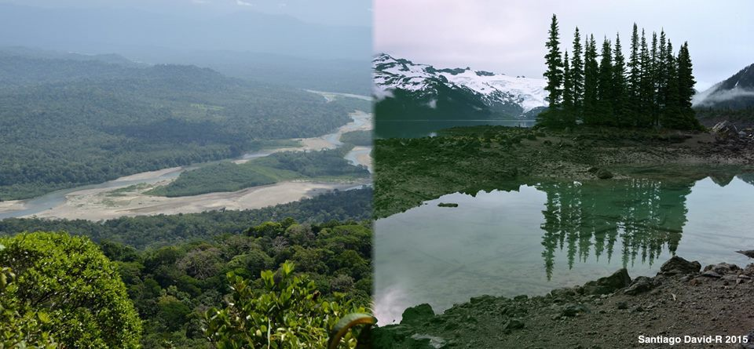

# STAT545 Homework Assignment #1
--------------------------------

Welcome to the repo of my first Assignment for [**STAT545**](http://stat545.com). My name is **Santiago David**, and I'm a PhD student in the [Jankowski Lab](http://www.zoology.ubc.ca/~jankowsk/) in the department of Zoology and Biodiversity Research Centre at UBC. I'm from Colombia and I study the ecology and evolution of tropical birds... so yes! I do travel a lot to the tropics to do fieldwork and escape winter in Canada, but I love both places...

### Reporting process...

At first I just created the Repo for this homework + README.md file and did my first edits to this using the browser. Then, I cloned the repo to my local copy and started using the recommended workflow *pull - edits - save - commit - push*

