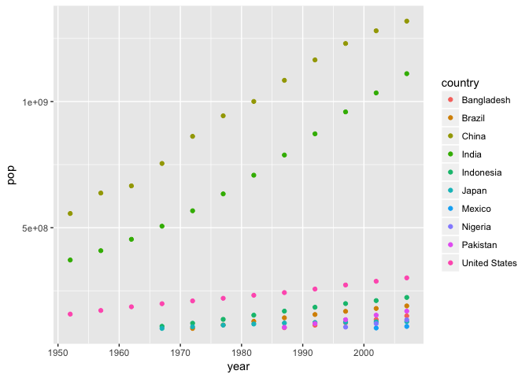

Gapminder exploration with dplyr and ggplot2 hw02
================

Bring data in
-------------

We already installed the packages, so I'll just load them

``` r
library("gapminder")
library("tidyverse")
```

    ## Loading tidyverse: ggplot2
    ## Loading tidyverse: tibble
    ## Loading tidyverse: tidyr
    ## Loading tidyverse: readr
    ## Loading tidyverse: purrr
    ## Loading tidyverse: dplyr

    ## Conflicts with tidy packages ----------------------------------------------

    ## filter(): dplyr, stats
    ## lag():    dplyr, stats

Smell test the data
-------------------

Is it a data.frame, a matrix, a vector, a list?

``` r
typeof(gapminder)
```

    ## [1] "list"

**Answer**: Gapminder is an object of the type *list*. I used the function `typeof` to ask for its type

What’s its class?

``` r
class(gapminder)
```

    ## [1] "tbl_df"     "tbl"        "data.frame"

**Answer**: If I understand *data structures*, gapminder is both a tibble and a dataframe as we can see using `class` for the different elements in the list.

How many variables/columns?

``` r
ncol(gapminder)
```

    ## [1] 6

**Answer**: There are 6 columns in gapminder. The easiest way to see this is using `ncol` as well as for the number of rows using `nrow`

How many rows/observations?

``` r
nrow(gapminder)
```

    ## [1] 1704

**Answer**: There are 1704 rows

Can you get these facts about “extent” or “size” in more than one way? Can you imagine different functions being useful in different contexts?

**Answer**: Yes! I'm sure there are tons of ways to do that in r. Two ways I can think of are using `dim` to see the dimensions of the dataframe, and `str` to see the whole structure. Personally, I always use `str` to inspect not only the dimensions of the dataframe but also the type of all variables. But in a different context if someone is only interested in the size of the dataframe, `dim` would make the trick.

``` r
dim(gapminder)
```

    ## [1] 1704    6

``` r
str(gapminder)
```

    ## Classes 'tbl_df', 'tbl' and 'data.frame':    1704 obs. of  6 variables:
    ##  $ country  : Factor w/ 142 levels "Afghanistan",..: 1 1 1 1 1 1 1 1 1 1 ...
    ##  $ continent: Factor w/ 5 levels "Africa","Americas",..: 3 3 3 3 3 3 3 3 3 3 ...
    ##  $ year     : int  1952 1957 1962 1967 1972 1977 1982 1987 1992 1997 ...
    ##  $ lifeExp  : num  28.8 30.3 32 34 36.1 ...
    ##  $ pop      : int  8425333 9240934 10267083 11537966 13079460 14880372 12881816 13867957 16317921 22227415 ...
    ##  $ gdpPercap: num  779 821 853 836 740 ...

What data type is each variable?

**Answer**: We can easily check this using `str` as seen above. *country* and *continent* are objects of the type `Factor`, *year* and *pop* are `integer`, and *lifeExp* and *gdpPercap* are `numeric`.

Explore individual variables
----------------------------

I will explore the categorical variable `country` and two quantitative variables population `pop` and year `year`

What are possible values (or range, whichever is appropriate) of each variable?

**Answer1**: For the categorical variable, we can see all possible values or *non-repeated* entries using the function `unique`

``` r
unique(gapminder$country)
```

    ##   [1] Afghanistan              Albania                 
    ##   [3] Algeria                  Angola                  
    ##   [5] Argentina                Australia               
    ##   [7] Austria                  Bahrain                 
    ##   [9] Bangladesh               Belgium                 
    ##  [11] Benin                    Bolivia                 
    ##  [13] Bosnia and Herzegovina   Botswana                
    ##  [15] Brazil                   Bulgaria                
    ##  [17] Burkina Faso             Burundi                 
    ##  [19] Cambodia                 Cameroon                
    ##  [21] Canada                   Central African Republic
    ##  [23] Chad                     Chile                   
    ##  [25] China                    Colombia                
    ##  [27] Comoros                  Congo, Dem. Rep.        
    ##  [29] Congo, Rep.              Costa Rica              
    ##  [31] Cote d'Ivoire            Croatia                 
    ##  [33] Cuba                     Czech Republic          
    ##  [35] Denmark                  Djibouti                
    ##  [37] Dominican Republic       Ecuador                 
    ##  [39] Egypt                    El Salvador             
    ##  [41] Equatorial Guinea        Eritrea                 
    ##  [43] Ethiopia                 Finland                 
    ##  [45] France                   Gabon                   
    ##  [47] Gambia                   Germany                 
    ##  [49] Ghana                    Greece                  
    ##  [51] Guatemala                Guinea                  
    ##  [53] Guinea-Bissau            Haiti                   
    ##  [55] Honduras                 Hong Kong, China        
    ##  [57] Hungary                  Iceland                 
    ##  [59] India                    Indonesia               
    ##  [61] Iran                     Iraq                    
    ##  [63] Ireland                  Israel                  
    ##  [65] Italy                    Jamaica                 
    ##  [67] Japan                    Jordan                  
    ##  [69] Kenya                    Korea, Dem. Rep.        
    ##  [71] Korea, Rep.              Kuwait                  
    ##  [73] Lebanon                  Lesotho                 
    ##  [75] Liberia                  Libya                   
    ##  [77] Madagascar               Malawi                  
    ##  [79] Malaysia                 Mali                    
    ##  [81] Mauritania               Mauritius               
    ##  [83] Mexico                   Mongolia                
    ##  [85] Montenegro               Morocco                 
    ##  [87] Mozambique               Myanmar                 
    ##  [89] Namibia                  Nepal                   
    ##  [91] Netherlands              New Zealand             
    ##  [93] Nicaragua                Niger                   
    ##  [95] Nigeria                  Norway                  
    ##  [97] Oman                     Pakistan                
    ##  [99] Panama                   Paraguay                
    ## [101] Peru                     Philippines             
    ## [103] Poland                   Portugal                
    ## [105] Puerto Rico              Reunion                 
    ## [107] Romania                  Rwanda                  
    ## [109] Sao Tome and Principe    Saudi Arabia            
    ## [111] Senegal                  Serbia                  
    ## [113] Sierra Leone             Singapore               
    ## [115] Slovak Republic          Slovenia                
    ## [117] Somalia                  South Africa            
    ## [119] Spain                    Sri Lanka               
    ## [121] Sudan                    Swaziland               
    ## [123] Sweden                   Switzerland             
    ## [125] Syria                    Taiwan                  
    ## [127] Tanzania                 Thailand                
    ## [129] Togo                     Trinidad and Tobago     
    ## [131] Tunisia                  Turkey                  
    ## [133] Uganda                   United Kingdom          
    ## [135] United States            Uruguay                 
    ## [137] Venezuela                Vietnam                 
    ## [139] West Bank and Gaza       Yemen, Rep.             
    ## [141] Zambia                   Zimbabwe                
    ## 142 Levels: Afghanistan Albania Algeria Angola Argentina ... Zimbabwe

We can also see from this list of names that there are 142 countries. Or we can directly ask that using `n_distinct` or `length`

``` r
length(unique(gapminder$country))
```

    ## [1] 142

For the **quantitative variables**, I am assuming there wont be data for many years so we can also use `unique` to see the specific years and `range` to see the oldest and most recent. But for population, we can expect that all countries will have different pop sizes every year, so that would be a very long list, in this case it is better to explore the range.

For `year`:

``` r
unique(gapminder$year) # only unique entries
```

    ##  [1] 1952 1957 1962 1967 1972 1977 1982 1987 1992 1997 2002 2007

``` r
range(gapminder$year) # gives min and max
```

    ## [1] 1952 2007

``` r
n_distinct(gapminder$year) # gives total of unique entries
```

    ## [1] 12

For `pop`

``` r
range(gapminder$pop)
```

    ## [1]      60011 1318683096

**Answer2**: There are data from 12 years starting in 1952 with the most recent data from 2007. There are population sizes starting from 60011 to 1318683096 (individuals!, I guess...)

What values are typical? What’s the spread? What’s the distribution? Etc., tailored to the variable at hand.

This would be more appropriate to explore using a quantitative variable that have lots of different values, such as *pop* (population size) vs *year*.

**Answer**: We can start exploring the values of a variable using the function `summary`. In this case the mean population size for all countries in all years is 2.960e+07; the smallest population recorded is 6.001e+04, and the largest is 1.319e+09.

``` r
summary(gapminder$pop)
```

    ##      Min.   1st Qu.    Median      Mean   3rd Qu.      Max. 
    ## 6.001e+04 2.794e+06 7.024e+06 2.960e+07 1.959e+07 1.319e+09

Since there are too many values for this variable (1704 using `n_distinct(gapminder$pop)`). It would be better to see the mean population size by country across years or in a given year, for which we will have to extract subsets of data. But I guess that is the objective in the next exercise. So for now, we can just visualize the distribution of population sizes in the whole data set using an histogram

``` r
hist(gapminder$pop)
```


Not a very nice plot, but we can see that there are many "small" values or populations and very few "big" populations.

We could also try to see this if we `cut` the variable *pop* in for example ten bins of equal size, and then count how many observations are in each bin:

``` r
x<-cut(gapminder$pop, breaks = 10) #break up continuous variable in 10 bins
table(x)
```

    ## x
    ## (-1.26e+06,1.32e+08]  (1.32e+08,2.64e+08]  (2.64e+08,3.96e+08] 
    ##                 1650                   27                    4 
    ##  (3.96e+08,5.28e+08]  (5.28e+08,6.59e+08]  (6.59e+08,7.91e+08] 
    ##                    3                    4                    4 
    ##  (7.91e+08,9.23e+08]  (9.23e+08,1.05e+09]  (1.05e+09,1.19e+09] 
    ##                    2                    4                    3 
    ##  (1.19e+09,1.32e+09] 
    ##                    3

Here, we can see that 1650 entries are in the lower 1/10 of all population values, which is basically between way less than 1 million and 132 millions of habitants, and very few entries are in values bigger than that...

Explore various plot types
--------------------------

First, I will plot population size per year for all countries, but colouring by continent. I want to visualize both, lines and points for each country.

``` r
ggplot(data = gapminder, 
       aes(x=year, y=pop, 
           by=country, color=continent)) +
  geom_line() + 
  geom_point()
```


I want to see the population growth but for very large countries, so I will filter the data to visualize only countries with more than 100 million people. I'm also `piping` filtered data into ggplot in order to practice `%>%` and `filter`

``` r
gapminder %>%
  filter(pop >= 1.00e+8) %>%
  ggplot(aes(x = year, y = pop,
             by = country, color = country)) +
  geom_point()
```



I want to also explore the distribution of population sizes by continent, so I will split continent into five panels and will use a density plot.

``` r
ggplot(data=gapminder, 
       aes(x=pop, 
          fill=continent))+
    geom_density()+
    facet_wrap(~continent)
```


More `filter`, `select` and `ggplot` and `%>%`
----------------------------------------------

I want to see the population growth of the smallest countries in the world. Meaning countries with less than a million habitants. I will export these data into a table first, and then will visualize them in a graph.

``` r
smallcountries <- filter(gapminder, pop <= 1.00e+6) %>%
  select(country, pop, year)
library(knitr)
kable(smallcountries[1:3])
```

| country               |     pop|  year|
|:----------------------|-------:|-----:|
| Bahrain               |  120447|  1952|
| Bahrain               |  138655|  1957|
| Bahrain               |  171863|  1962|
| Bahrain               |  202182|  1967|
| Bahrain               |  230800|  1972|
| Bahrain               |  297410|  1977|
| Bahrain               |  377967|  1982|
| Bahrain               |  454612|  1987|
| Bahrain               |  529491|  1992|
| Bahrain               |  598561|  1997|
| Bahrain               |  656397|  2002|
| Bahrain               |  708573|  2007|
| Botswana              |  442308|  1952|
| Botswana              |  474639|  1957|
| Botswana              |  512764|  1962|
| Botswana              |  553541|  1967|
| Botswana              |  619351|  1972|
| Botswana              |  781472|  1977|
| Botswana              |  970347|  1982|
| Comoros               |  153936|  1952|
| Comoros               |  170928|  1957|
| Comoros               |  191689|  1962|
| Comoros               |  217378|  1967|
| Comoros               |  250027|  1972|
| Comoros               |  304739|  1977|
| Comoros               |  348643|  1982|
| Comoros               |  395114|  1987|
| Comoros               |  454429|  1992|
| Comoros               |  527982|  1997|
| Comoros               |  614382|  2002|
| Comoros               |  710960|  2007|
| Congo, Rep.           |  854885|  1952|
| Congo, Rep.           |  940458|  1957|
| Costa Rica            |  926317|  1952|
| Djibouti              |   63149|  1952|
| Djibouti              |   71851|  1957|
| Djibouti              |   89898|  1962|
| Djibouti              |  127617|  1967|
| Djibouti              |  178848|  1972|
| Djibouti              |  228694|  1977|
| Djibouti              |  305991|  1982|
| Djibouti              |  311025|  1987|
| Djibouti              |  384156|  1992|
| Djibouti              |  417908|  1997|
| Djibouti              |  447416|  2002|
| Djibouti              |  496374|  2007|
| Equatorial Guinea     |  216964|  1952|
| Equatorial Guinea     |  232922|  1957|
| Equatorial Guinea     |  249220|  1962|
| Equatorial Guinea     |  259864|  1967|
| Equatorial Guinea     |  277603|  1972|
| Equatorial Guinea     |  192675|  1977|
| Equatorial Guinea     |  285483|  1982|
| Equatorial Guinea     |  341244|  1987|
| Equatorial Guinea     |  387838|  1992|
| Equatorial Guinea     |  439971|  1997|
| Equatorial Guinea     |  495627|  2002|
| Equatorial Guinea     |  551201|  2007|
| Gabon                 |  420702|  1952|
| Gabon                 |  434904|  1957|
| Gabon                 |  455661|  1962|
| Gabon                 |  489004|  1967|
| Gabon                 |  537977|  1972|
| Gabon                 |  706367|  1977|
| Gabon                 |  753874|  1982|
| Gabon                 |  880397|  1987|
| Gabon                 |  985739|  1992|
| Gambia                |  284320|  1952|
| Gambia                |  323150|  1957|
| Gambia                |  374020|  1962|
| Gambia                |  439593|  1967|
| Gambia                |  517101|  1972|
| Gambia                |  608274|  1977|
| Gambia                |  715523|  1982|
| Gambia                |  848406|  1987|
| Guinea-Bissau         |  580653|  1952|
| Guinea-Bissau         |  601095|  1957|
| Guinea-Bissau         |  627820|  1962|
| Guinea-Bissau         |  601287|  1967|
| Guinea-Bissau         |  625361|  1972|
| Guinea-Bissau         |  745228|  1977|
| Guinea-Bissau         |  825987|  1982|
| Guinea-Bissau         |  927524|  1987|
| Iceland               |  147962|  1952|
| Iceland               |  165110|  1957|
| Iceland               |  182053|  1962|
| Iceland               |  198676|  1967|
| Iceland               |  209275|  1972|
| Iceland               |  221823|  1977|
| Iceland               |  233997|  1982|
| Iceland               |  244676|  1987|
| Iceland               |  259012|  1992|
| Iceland               |  271192|  1997|
| Iceland               |  288030|  2002|
| Iceland               |  301931|  2007|
| Jordan                |  607914|  1952|
| Jordan                |  746559|  1957|
| Jordan                |  933559|  1962|
| Kuwait                |  160000|  1952|
| Kuwait                |  212846|  1957|
| Kuwait                |  358266|  1962|
| Kuwait                |  575003|  1967|
| Kuwait                |  841934|  1972|
| Lesotho               |  748747|  1952|
| Lesotho               |  813338|  1957|
| Lesotho               |  893143|  1962|
| Lesotho               |  996380|  1967|
| Liberia               |  863308|  1952|
| Liberia               |  975950|  1957|
| Mauritius             |  516556|  1952|
| Mauritius             |  609816|  1957|
| Mauritius             |  701016|  1962|
| Mauritius             |  789309|  1967|
| Mauritius             |  851334|  1972|
| Mauritius             |  913025|  1977|
| Mauritius             |  992040|  1982|
| Mongolia              |  800663|  1952|
| Mongolia              |  882134|  1957|
| Montenegro            |  413834|  1952|
| Montenegro            |  442829|  1957|
| Montenegro            |  474528|  1962|
| Montenegro            |  501035|  1967|
| Montenegro            |  527678|  1972|
| Montenegro            |  560073|  1977|
| Montenegro            |  562548|  1982|
| Montenegro            |  569473|  1987|
| Montenegro            |  621621|  1992|
| Montenegro            |  692651|  1997|
| Montenegro            |  720230|  2002|
| Montenegro            |  684736|  2007|
| Namibia               |  485831|  1952|
| Namibia               |  548080|  1957|
| Namibia               |  621392|  1962|
| Namibia               |  706640|  1967|
| Namibia               |  821782|  1972|
| Namibia               |  977026|  1977|
| Oman                  |  507833|  1952|
| Oman                  |  561977|  1957|
| Oman                  |  628164|  1962|
| Oman                  |  714775|  1967|
| Oman                  |  829050|  1972|
| Panama                |  940080|  1952|
| Reunion               |  257700|  1952|
| Reunion               |  308700|  1957|
| Reunion               |  358900|  1962|
| Reunion               |  414024|  1967|
| Reunion               |  461633|  1972|
| Reunion               |  492095|  1977|
| Reunion               |  517810|  1982|
| Reunion               |  562035|  1987|
| Reunion               |  622191|  1992|
| Reunion               |  684810|  1997|
| Reunion               |  743981|  2002|
| Reunion               |  798094|  2007|
| Sao Tome and Principe |   60011|  1952|
| Sao Tome and Principe |   61325|  1957|
| Sao Tome and Principe |   65345|  1962|
| Sao Tome and Principe |   70787|  1967|
| Sao Tome and Principe |   76595|  1972|
| Sao Tome and Principe |   86796|  1977|
| Sao Tome and Principe |   98593|  1982|
| Sao Tome and Principe |  110812|  1987|
| Sao Tome and Principe |  125911|  1992|
| Sao Tome and Principe |  145608|  1997|
| Sao Tome and Principe |  170372|  2002|
| Sao Tome and Principe |  199579|  2007|
| Swaziland             |  290243|  1952|
| Swaziland             |  326741|  1957|
| Swaziland             |  370006|  1962|
| Swaziland             |  420690|  1967|
| Swaziland             |  480105|  1972|
| Swaziland             |  551425|  1977|
| Swaziland             |  649901|  1982|
| Swaziland             |  779348|  1987|
| Swaziland             |  962344|  1992|
| Trinidad and Tobago   |  662850|  1952|
| Trinidad and Tobago   |  764900|  1957|
| Trinidad and Tobago   |  887498|  1962|
| Trinidad and Tobago   |  960155|  1967|
| Trinidad and Tobago   |  975199|  1972|

Now, I want to see the population growth of the "small" countries by continent, so basically countries that have less than 1 million habitants.

``` r
filter(gapminder, pop <= 1.00e+6) %>% 
  ggplot(aes(x=year, y=pop,
             by = country, color = country)) + 
  geom_point(alpha=0.5) + 
  facet_wrap(~continent)
```


