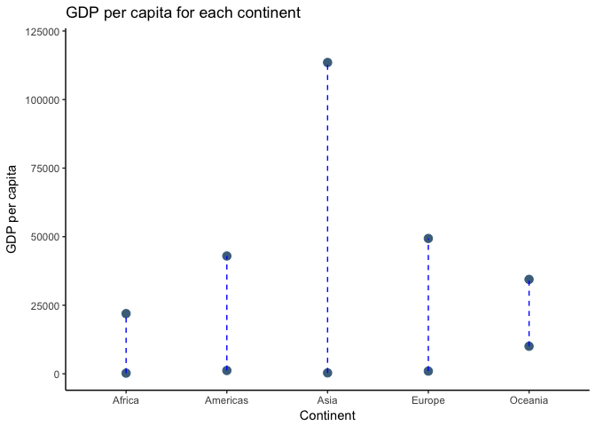
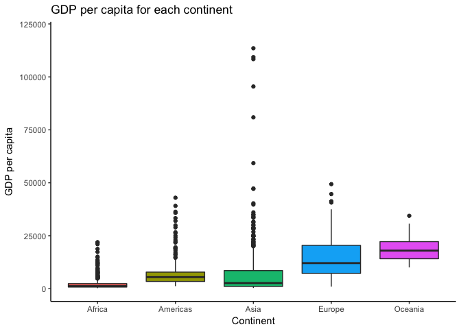

Use dplyr to manipulate and explore data
================
Santiago D
2017-10-02

### Load data and packages

``` r
library("gapminder")
library("tidyverse")
```

    ## Loading tidyverse: ggplot2
    ## Loading tidyverse: tibble
    ## Loading tidyverse: tidyr
    ## Loading tidyverse: readr
    ## Loading tidyverse: purrr
    ## Loading tidyverse: dplyr

    ## Conflicts with tidy packages ----------------------------------------------

    ## filter(): dplyr, stats
    ## lag():    dplyr, stats

### Tasks selected

-   Maximum and minimum GDP per capita for all continents
-   

Task \#1
--------

**Objective**: Get the maximum and minimum of GDP per capita for all continents.

**Process**: Use `group_by` and `summarise` to obtain the min and max of the variable, save that as a new object and use that object to create a table using `knitr::kable` and plot using `ggplot2`.

**Resources**: I got some ideas for the graph from this `stackoverflow` [link](https://stackoverflow.com/questions/27205629/plot-ranges-of-variable-in-data)

``` r
gdpsummary <- gapminder %>% 
  group_by(continent) %>% 
  summarise(min_gdpPercap = min(gdpPercap),
            max_gdpPercap = max(gdpPercap),
            mean_gdpPercap = mean(gdpPercap))
```

Table

``` r
knitr::kable(gdpsummary, 
             col.names = c("Continent", "Minimum GDP per capita", "Maximum GDP per capita", "Mean GDP per capita"))
```

| Continent |  Minimum GDP per capita|  Maximum GDP per capita|  Mean GDP per capita|
|:----------|-----------------------:|-----------------------:|--------------------:|
| Africa    |                241.1659|                21951.21|             2193.755|
| Americas  |               1201.6372|                42951.65|             7136.110|
| Asia      |                331.0000|               113523.13|             7902.150|
| Europe    |                973.5332|                49357.19|            14469.476|
| Oceania   |              10039.5956|                34435.37|            18621.609|

Figure

``` r
ggplot(gdpsummary, aes(x = continent)) +
  geom_point(aes(y = min_gdpPercap), size = 3, color = "skyblue4") +
  geom_point(aes(y = max_gdpPercap), size = 3, color = "skyblue4") +
  geom_linerange(aes(ymin = min_gdpPercap,ymax = max_gdpPercap),linetype = 2,color = "blue") +
  labs(title = "GDP per capita for each continent", x = "Continent", y = "GDP per capita") +
  ylim(0,120000) +
  theme_classic()
```



Optional Figure

Another option would be to use a boxplot of GDP per capita per continent, which would display a better distribution of the values, including the minimum and maximum.

``` r
gapminder %>% 
  group_by(continent) %>% 
  ggplot(aes(x = continent, y = gdpPercap, fill = continent)) +
  geom_boxplot() +
  labs(title = "GDP per capita for each continent", x = "Continent", y = "GDP per capita") +
  ylim(0, 120000) +
  guides(fill = FALSE) +
  theme_classic()
```


