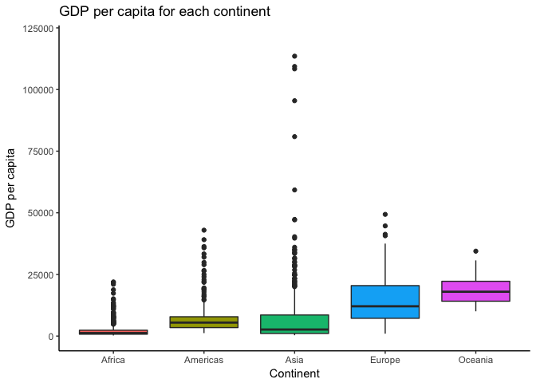
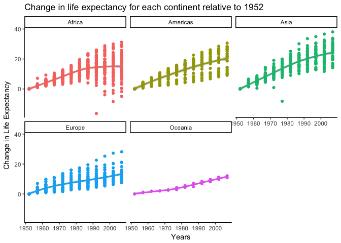
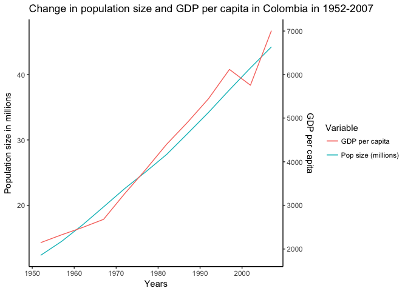

Use dplyr to manipulate and explore data
================
Santiago David
2017-10-02

### Load data and packages

``` r
suppressPackageStartupMessages(library(tidyverse))
suppressPackageStartupMessages(library(gapminder))
```

### Tasks selected

-   Maximum and minimum GDP per capita for all continents
-   Spread of GDP per capita within continent
-   Life expectancy change over time on different continents
-   Custom one and maybe interesting story

Task \#1
--------

**Objective**: Get the maximum and minimum of GDP per capita for all continents.

**Process**: Use `group_by` and `summarise` to obtain the min and max of the variable, save that as a new object and use that object to create a table using `knitr::kable` and plot using `ggplot2`.

**Additional Resources**: I got some ideas for the graph from [this](https://stackoverflow.com/questions/27205629/plot-ranges-of-variable-in-data) stackoverflow post

``` r
gdpsummary <- gapminder %>% 
  group_by(continent) %>% 
  summarise(min_gdpPercap = min(gdpPercap),
            max_gdpPercap = max(gdpPercap),
            mean_gdpPercap = mean(gdpPercap))
```

Table

``` r
knitr::kable(gdpsummary, col.names = c("Continent", "Minimum GDP per capita", 
                                       "Maximum GDP per capita", "Mean GDP per capita"))
```

| Continent |  Minimum GDP per capita|  Maximum GDP per capita|  Mean GDP per capita|
|:----------|-----------------------:|-----------------------:|--------------------:|
| Africa    |                241.1659|                21951.21|             2193.755|
| Americas  |               1201.6372|                42951.65|             7136.110|
| Asia      |                331.0000|               113523.13|             7902.150|
| Europe    |                973.5332|                49357.19|            14469.476|
| Oceania   |              10039.5956|                34435.37|            18621.609|

Figure

``` r
ggplot(gdpsummary, aes(x = continent)) +
  geom_point(aes(y = min_gdpPercap), size = 3, color = "skyblue4") +
  geom_point(aes(y = max_gdpPercap), size = 3, color = "skyblue4") +
  geom_linerange(aes(ymin = min_gdpPercap,ymax = max_gdpPercap),linetype = 2,color = "blue") +
  labs(title = "GDP per capita for each continent", x = "Continent", y = "GDP per capita") +
  ylim(0,120000) +
  theme_classic()
```


**Observations**: We can see from both the table and the figure that Asia has the greatest range in GDP per capita, and Oceania and Africa have small ranges compared to the other continents, but Oceania with very high minimum and maximum values for GDP per capita compared to Africa. A boxplot would be particularly useful in showing the distribution of values (see next task).

Task \#2
--------

**Objective**: Look at the spread of GDP per capita within the continents

**Process**: There are different ways to describe the spread of a variable. I think a good way is using a boxplot which gives you the minimum, maximum, median and quantiles for the variable of interest. I used `group_by` and `summarize` to create 25%, 50%, and 75% quantiles of GDP per capita for each continent, plus the mean and standard deviation, and a boxplot to show the spread of this variable. I used `knitr::kable` and `ggplot` to create the output.

**Additional Resources**: I got help from [this](https://stackoverflow.com/questions/30488389/using-dplyr-window-functions-to-calculate-percentiles) stackoverflow post to use `quantile`

``` r
gdpsum <- gapminder %>% 
  group_by(continent) %>% 
  summarise(avg = mean(gdpPercap),
            sd = sd(gdpPercap),
            "25%" = quantile(gdpPercap, probs = 0.25),
            "50%" = quantile(gdpPercap, probs = 0.50),
            "75%" = quantile(gdpPercap, probs = 0.75), 
            n = n())
```

Table

``` r
knitr::kable(gdpsum, col.names = c("Continent", "GDP per capita (Mean)", 
                                       "GDP per capita (SD)", "lower quantile", 
                                   "middle quantile", "upper quantile", "sample size (n)"),
             digits = 1)
```

| Continent |  GDP per capita (Mean)|  GDP per capita (SD)|  lower quantile|  middle quantile|  upper quantile|  sample size (n)|
|:----------|----------------------:|--------------------:|---------------:|----------------:|---------------:|----------------:|
| Africa    |                 2193.8|               2827.9|           761.2|           1192.1|          2377.4|              624|
| Americas  |                 7136.1|               6396.8|          3427.8|           5465.5|          7830.2|              300|
| Asia      |                 7902.2|              14045.4|          1057.0|           2646.8|          8549.3|              396|
| Europe    |                14469.5|               9355.2|          7213.1|          12081.7|         20461.4|              360|
| Oceania   |                18621.6|               6359.0|         14141.9|          17983.3|         22214.1|               24|

Figure

``` r
gapminder %>% 
  group_by(continent) %>% 
  ggplot(aes(x = continent, y = gdpPercap, fill = continent)) +
  geom_boxplot() +
  labs(title = "GDP per capita for each continent", x = "Continent", y = "GDP per capita") +
  ylim(0, 120000) +
  guides(fill = FALSE) +
  theme_classic()
```



**Observations**: The boxplot and table show the spread of GDP per capita within continents, we can see that for all continents most of the data are skewed towards the lower half of possible GDP values, there are very few extreme high values for GDP per capita, especially for Asia. Also, we can check in the table that although America and Asia have relatively similar mean GDP per capita (~7000), the variation (SD) in Asia is very large compared to America (14045 vs 6396.8), because the values for Asia are more spread.

Task \#3
--------

**Objective**: How is life expectancy changing over time on different continents?

**Process**: Use `group_by` and `mutate` to create a new variable that capture the change in ife expectancy over years, but in this case by calculating the difference between life expectancy in a given year with the first year with data for each country. I saved that as a new object.

To display the change over time per continent in a table, I decided to summarize the *average* change in life expectancy per year and used `knitr::kable`. However for the graph, it is more informative to keep all values for each country, but including a linear regression per continent to see the trend in change of life expectancy, also using `ggplot2`.

**Additional Resources**: I used the function `spread` to display an optional table following [this](http://tidyr.tidyverse.org/reference/spread.html) link

``` r
life_change <- gapminder %>% 
  group_by(country) %>% 
  arrange(year) %>% 
  mutate (change_lifeExp = lifeExp - lifeExp[1]) 
```

Table option 1 (only visualizing the very first rows, 'cause its a long table)

``` r
mean_change <- life_change %>% 
  group_by(continent, year) %>% 
  summarise(mean_change = mean(change_lifeExp))
head(mean_change) %>%  knitr::kable(col.names = c("Continent", "year", "Mean ∆ Life expectancy"))
```

| Continent |  year|  Mean ∆ Life expectancy|
|:----------|-----:|-----------------------:|
| Africa    |  1952|                0.000000|
| Africa    |  1957|                2.130846|
| Africa    |  1962|                4.183942|
| Africa    |  1967|                6.199039|
| Africa    |  1972|                8.315442|
| Africa    |  1977|               10.444923|

Table option 2 (using `spread` from tidyr to see a comparison across years of the mean change in life expectancy by continent)

``` r
mean_change <- life_change %>% 
  group_by(continent, year) %>% 
  summarise(mean_change = mean(change_lifeExp)) %>% 
  spread(year, mean_change)
knitr::kable(mean_change)
```

| continent |  1952|      1957|      1962|      1967|       1972|       1977|      1982|       1987|      1992|      1997|      2002|      2007|
|:----------|-----:|---------:|---------:|---------:|----------:|----------:|---------:|----------:|---------:|---------:|---------:|---------:|
| Africa    |     0|  2.130846|  4.183942|  6.199039|   8.315442|  10.444923|  12.45737|  14.209288|  14.49408|  14.46277|  14.18973|  15.67054|
| Americas  |     0|  2.680440|  5.118920|  7.131080|   9.115080|  11.111720|  12.94900|  14.810880|  16.28852|  17.87064|  19.14220|  20.32828|
| Asia      |     0|  3.004150|  5.248829|  8.349246|  11.004875|  13.296162|  16.30355|  18.536788|  20.22282|  21.70612|  22.91948|  24.41409|
| Europe    |     0|  2.294567|  4.130733|  5.329100|   6.366533|   7.529267|   8.39790|   9.233667|  10.03160|  11.09667|  12.29210|  13.24010|
| Oceania   |     0|  1.040000|  1.830000|  2.055000|   2.655000|   3.600000|   5.03500|   6.065000|   7.69000|   8.93500|  10.48500|  11.46450|

Figure

``` r
ggplot(life_change, aes(year, change_lifeExp, colour = continent)) +
  geom_point() +
  facet_wrap(~ continent) +
  geom_smooth(method = "loess") +
  labs(title = "Change in life expectancy for each continent relative to 1952", x = "Years", y = "Change in Life Expectancy") +
  guides(colour = FALSE) +
  theme_classic() 
```



**Observations**: There must be lots of ways to show the change in Life expectancy over years for each continent. I decided to calculate the change in life expectancy relative to the first year in the database, which is 1952. We can see from the table and figure that overall all continents have shown an increase in life expectancy from 1952 to 2007. Asia and America exhibit a very high increase in life expectancy in this time period of 24.4 and 20.3 years, respectively, compared to the other continents. This is also evident in the slopes of the graph. Interestingly, there are some points in the graph that exhibit a negative value, which imply that for that year the life expectancy of that country was actually lower than the life expectancy in 1952.

Task 4 (just for curiosity and maybe interesting story so it plays for both...)
-------------------------------------------------------------------------------

**Objective**: I want to see how are population growth and GDP per capita changing in my home country = Colombia (not Columbia)... I'm just curious since I would guess we have grown way faster than our economy, and I want to try plotting two y-axis using ggplot.

**Process**: I will just filter gapminder for "colombia" , and will create a two y-axis graph using `ggplot2` and `knitr::kable` as always. I transformed population to be shown in millions, and saved a object only with the data of interest for Colombia.

**Additional resources**: This plot was only possible thanks to [this](https://rpubs.com/MarkusLoew/226759) Rpubs post!!!!, Thanks a lot!!!

Table

``` r
gapminder %>% 
  filter(country == "Colombia") %>%
  mutate(popmillions = pop/1000000) %>% 
  select(year, popmillions, gdpPercap) -> colombia
knitr::kable(colombia, col.names = c("Year", "Population size in millions", "GDP per capita"))
```

|  Year|  Population size in millions|  GDP per capita|
|-----:|----------------------------:|---------------:|
|  1952|                     12.35077|        2144.115|
|  1957|                     14.48599|        2323.806|
|  1962|                     17.00989|        2492.351|
|  1967|                     19.76403|        2678.730|
|  1972|                     22.54289|        3264.660|
|  1977|                     25.09441|        3815.808|
|  1982|                     27.76464|        4397.576|
|  1987|                     30.96424|        4903.219|
|  1992|                     34.20272|        5444.649|
|  1997|                     37.65783|        6117.362|
|  2002|                     41.00823|        5755.260|
|  2007|                     44.22755|        7006.580|

Figure

``` r
colombia %>% 
  ggplot(aes(x = year)) +
  geom_line(aes(y = popmillions, colour = "Pop size (millions)")) +
  geom_line(aes(y = gdpPercap/150, colour = "GDP per capita")) + #need transformation
  scale_y_continuous(sec.axis = sec_axis(~.*150, name = "GDP per capita")) + #needs to revert trans
  labs(title = "Change in population size and GDP per capita in Colombia in 1952-2007", x = "Years", y = "Population size in millions", colour = "Variable") +
  theme_classic()
```



**Observations**: First, it wasn't that easy to create a two y-axis plot... But I guess it is sort of interesting to see, that both variables have continously increased in the time period, and that GDP per cap crashed a bit in the late 90's compared to the population growth that have never stopped!, crazy!
