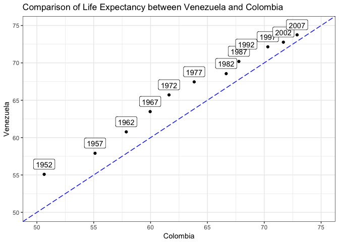

Homework 4: Tidy data and joins
================
Santiago David
2017-10-06

### Load data and packages

``` r
suppressPackageStartupMessages(library(tidyverse))
suppressPackageStartupMessages(library(gapminder))
```

Data reshaping
--------------

### Activity \#2

**Objective**: Make a tibble with one row per year and columns for life expectancy for two or more countries, and use that to make a plot.

**Process**: Colombia and Venezuela were the same country many years ago, I'm curious how life expectancy have changed in their recent past (as separate countries), so I will analyze them. First, I filter gapminder by those two countries and all years. Then, I select the variables `country`,`year`, and `lifeExp`, and use `spread` to convert that table into its wide format, and save as a new object.

``` r
colven <- gapminder %>% 
  filter(country %in% c("Colombia", "Venezuela")) %>% 
  select(country, year, lifeExp) %>% 
  spread(country, lifeExp)
knitr::kable(colven, col.names = c("Year", "Life expectancy in Colombia", "Life expectancy in Venezuela"))
```

|  Year|  Life expectancy in Colombia|  Life expectancy in Venezuela|
|-----:|----------------------------:|-----------------------------:|
|  1952|                       50.643|                        55.088|
|  1957|                       55.118|                        57.907|
|  1962|                       57.863|                        60.770|
|  1967|                       59.963|                        63.479|
|  1972|                       61.623|                        65.712|
|  1977|                       63.837|                        67.456|
|  1982|                       66.653|                        68.557|
|  1987|                       67.768|                        70.190|
|  1992|                       68.421|                        71.150|
|  1997|                       70.313|                        72.146|
|  2002|                       71.682|                        72.766|
|  2007|                       72.889|                        73.747|

**Figure**: We can use this new data shape to look at the comparison of life expectancy of Colombia vs Venezuela. I will include a `geom_abline` with slope=1 and intercept=0, so we can see how different is this comparison to a perfect 1 to 1 relationship in life expectancy for both countries over the years.

``` r
colven %>% 
  ggplot(aes(x = Colombia, y = Venezuela)) +
  geom_point() +
  geom_label(aes(x = Colombia, y = Venezuela, label = year, vjust = -0.5)) + #add years to points
  ylim(50, 75) + xlim(50, 75) +
  geom_abline(slope = 1, intercept = 0, colour = "4", linetype="longdash") + #add line
  ggtitle("Comparison of Life Expectancy between Venezuela and Colombia") +
  theme_bw()
```



**Observations**: From this figure and table we can see that both countries have increased their life expectancy over the years, but Venezuela has always had a life expectancy higher than Colombia (above blue line), especially in the 50's-60's. Both countries have a more similar life expectancy in recent years (closer to blue line).

**Additional resources**: I got help from the ggplot2 reference webpage for adding [text and labels to a plot](http://ggplot2.tidyverse.org/reference/geom_text.html).

Join, merge, look up
--------------------

### Activiy \#1

**Objective**: Create a second data frame, complementary to Gapminder. Join this with (part of) Gapminder using a dplyr join function and make some observations about the process and result. Explore the different types of joins.

**Process**: Rather than creating a second data frame, I decided to get some open access data from the internet to practice `joins` for this activity. I'm interested in global land use change, so I think it will be perfect if I can add a new variable for agricultural land area per year for each country. I googled and found open access data for Agricultural land (sq. km) for all countries in the world from [The World Bank](http://www.worldbank.org) official webpage for years between 1961-2014. The data can be downloaded as `.csv` file from [this site](https://data.worldbank.org/indicator/AG.LND.AGRI.K2?end=2016&start=1961&view=chart), and because the license says "open", I'm assuming it is okay to use it here as an example (not 100% sure).

There might be different country names between databases and thera are also more years for the second database. So the challenge, is to use a `join` to extract data for agricultural land per country for the years with data in gapminder, and add a new column with those data to gapminder.

Loading the data

``` r
agrland <- read.csv("agri_data.csv") #load second database
str(agrland) #check structure
```

    ## 'data.frame':    264 obs. of  61 variables:
    ##  $ Country.Name  : Factor w/ 264 levels "Afghanistan",..: 11 1 6 2 5 8 250 9 10 4 ...
    ##  $ Country.Code  : Factor w/ 264 levels "ABW","AFG","AGO",..: 1 2 3 4 5 6 7 8 9 10 ...
    ##  $ Indicator.Name: Factor w/ 1 level "Agricultural land (sq. km)": 1 1 1 1 1 1 1 1 1 1 ...
    ##  $ Indicator.Code: Factor w/ 1 level "AG.LND.AGRI.K2": 1 1 1 1 1 1 1 1 1 1 ...
    ##  $ X1960         : logi  NA NA NA NA NA NA ...
    ##  $ X1961         : int  20 377000 571700 12320 260 4215860 2080 1378290 NA 30 ...
    ##  $ X1962         : int  20 377600 572000 12320 260 4215840 2080 1364340 NA 30 ...
    ##  $ X1963         : int  20 378100 572200 12330 260 4218970 2080 1348750 NA 30 ...
    ##  $ X1964         : int  20 378730 572500 12300 260 4220260 2080 1332970 NA 30 ...
    ##  $ X1965         : int  20 378750 572700 12370 260 4223400 2090 1317800 NA 30 ...
    ##  $ X1966         : int  20 379130 573000 12400 260 4224290 2100 1309480 NA 30 ...
    ##  $ X1967         : int  20 379790 573300 12440 260 4231280 2100 1297030 NA 30 ...
    ##  $ X1968         : int  20 379800 573600 12400 260 4235220 2100 1292350 NA 30 ...
    ##  $ X1969         : int  20 379960 574000 12350 260 4242770 2100 1293020 NA 30 ...
    ##  $ X1970         : int  20 380060 574000 12300 260 4251290 2120 1292800 NA 30 ...
    ##  $ X1971         : int  20 380360 574000 12000 250 4277870 2120 1291540 NA 30 ...
    ##  $ X1972         : int  20 380460 574000 11740 250 4284320 2120 1290280 NA 30 ...
    ##  $ X1973         : int  20 380480 574000 11460 240 4283680 2130 1289020 NA 30 ...
    ##  $ X1974         : int  20 380480 574000 11220 240 4290840 2140 1287760 NA 30 ...
    ##  $ X1975         : int  20 380480 574000 10800 240 4287780 2150 1286500 NA 30 ...
    ##  $ X1976         : int  20 380480 574000 10750 230 4297140 2160 1285240 NA 30 ...
    ##  $ X1977         : int  20 380500 574000 11090 230 4299980 2170 1283980 NA 30 ...
    ##  $ X1978         : int  20 380500 574000 11140 230 4305790 2180 1282720 NA 30 ...
    ##  $ X1979         : int  20 380490 574000 11170 220 4307280 2190 1281460 NA 30 ...
    ##  $ X1980         : int  20 380490 574000 11180 220 4318030 2230 1280200 NA 30 ...
    ##  $ X1981         : int  20 380530 574000 11160 210 4276396 2270 1278940 NA 30 ...
    ##  $ X1982         : int  20 380540 574000 11140 210 4279693 2270 1287690 NA 30 ...
    ##  $ X1983         : int  20 380540 574000 11100 210 4286067 2320 1286440 NA 30 ...
    ##  $ X1984         : int  20 380540 574000 11130 200 4342134 2320 1285170 NA 30 ...
    ##  $ X1985         : int  20 380540 574000 11120 200 4409938 2350 1283910 NA 30 ...
    ##  $ X1986         : int  20 380540 574000 11110 200 4489258 2380 1282650 NA 30 ...
    ##  $ X1987         : int  20 380450 574000 11110 190 4564760 2380 1279390 NA 30 ...
    ##  $ X1988         : int  20 380400 574000 11170 190 4645290 2390 1273800 NA 30 ...
    ##  $ X1989         : int  20 380400 574000 11100 190 4716088 2390 1274700 NA 30 ...
    ##  $ X1990         : int  20 380400 574040 11210 190 4772142 2850 1275650 NA 30 ...
    ##  $ X1991         : int  20 380300 574500 11270 190 4784464 3100 1276600 NA 30 ...
    ##  $ X1992         : int  20 380300 575000 11270 190 4806420 3390 1277550 11700 32 ...
    ##  $ X1993         : int  20 379340 575000 11260 190 5344200 3550 1278500 11810 32 ...
    ##  $ X1994         : int  20 378130 575000 11260 190 5363840 3720 1279480 12000 32 ...
    ##  $ X1995         : int  20 377530 575000 11270 190 5377560 3830 1280450 12440 35 ...
    ##  $ X1996         : int  20 377520 575000 11310 190 5388755 3920 1281420 13060 40 ...
    ##  $ X1997         : int  20 377900 575000 11350 190 5388279 4000 1282350 13320 40 ...
    ##  $ X1998         : int  20 378670 575000 11390 187 5393336 4030 1283300 13280 47 ...
    ##  $ X1999         : int  20 377530 574000 11450 188 5395305 5210 1284120 13230 48 ...
    ##  $ X2000         : int  20 377530 573000 11440 188 5395402 5520 1285100 13230 48 ...
    ##  $ X2001         : int  20 377530 573000 11390 187 5400131 5670 1286060 13280 45 ...
    ##  $ X2002         : int  20 377530 573900 11400 197 5412411 5710 1287100 13910 45 ...
    ##  $ X2003         : int  20 379100 575900 11210 199 5436802 5590 1308835 14440 50 ...
    ##  $ X2004         : int  20 379110 575900 11220 199 5444076 5590 1343450 15050 50 ...
    ##  $ X2005         : int  20 379100 575900 10770 197 5457617 5620 1377975 16050 50 ...
    ##  $ X2006         : int  20 379100 575900 11200 195 5460208 5436 1411040 17564 50 ...
    ##  $ X2007         : int  20 379100 576900 11190 194 5466390 5376 1440330 17519 48 ...
    ##  $ X2008         : int  20 379100 576900 11810 197 5458209 5446 1442610 17488 48 ...
    ##  $ X2009         : int  20 379100 582900 12013 199 5108979 3929 1437920 17463 49 ...
    ##  $ X2010         : int  20 379100 583900 12013 201 5092143 3973 1474810 17350 49 ...
    ##  $ X2011         : int  20 379110 589900 12010 204 4775629 3935 1482810 16981 49 ...
    ##  $ X2012         : int  20 379100 589900 12013 202 4779423 3817 1492540 16830 49 ...
    ##  $ X2013         : int  20 379100 591900 11873 208 4790098 3823 1491990 16821 49 ...
    ##  $ X2014         : int  20 379100 591900 11743 209 4795283 3823 1487000 16811 49 ...
    ##  $ X2015         : logi  NA NA NA NA NA NA ...
    ##  $ X2016         : logi  NA NA NA NA NA NA ...

So, from this database we only need country names, years and agricultural land. I have to get a subset of data and reshape the years in a long format. Also I have to rename `year`, since originally the names for columns were not valid and now they all have an `X` before year. **note**: If you know how to do it using `mutate` please let me know... I had to use a different library `stringr` and `str_replace` following [this](https://stackoverflow.com/questions/9704213/r-remove-part-of-string) post

``` r
agrland2 <- agrland %>%
  select(Country.Name, X1961:X2014) %>% 
  gather(key = "year", value = "agri_land", X1961:X2014) %>% 
  rename(country = Country.Name)

library("stringr") # load library and fix names
agrland2$year <- str_replace(agrland2$year, "[X]","")
```

Now we can double check that both databases match in the variables of interest `year` and `country` to do the join.

``` r
head(gapminder)
```

    ## # A tibble: 6 x 6
    ##       country continent  year lifeExp      pop gdpPercap
    ##        <fctr>    <fctr> <int>   <dbl>    <int>     <dbl>
    ## 1 Afghanistan      Asia  1952  28.801  8425333  779.4453
    ## 2 Afghanistan      Asia  1957  30.332  9240934  820.8530
    ## 3 Afghanistan      Asia  1962  31.997 10267083  853.1007
    ## 4 Afghanistan      Asia  1967  34.020 11537966  836.1971
    ## 5 Afghanistan      Asia  1972  36.088 13079460  739.9811
    ## 6 Afghanistan      Asia  1977  38.438 14880372  786.1134

``` r
head(agrland2)
```

    ##       country year agri_land
    ## 1       Aruba 1961        20
    ## 2 Afghanistan 1961    377000
    ## 3      Angola 1961    571700
    ## 4     Albania 1961     12320
    ## 5     Andorra 1961       260
    ## 6  Arab World 1961   4215860

**Finally, I can explore joins**

I want to keep all gapminder information and add new column with agricultural land values, but only for countries and years in gapminder.

First try gives error, because incompatible types in `year`. Which makes sense, because `year` in my second database was read as an object of the type character. So, I have to make them the same type...

``` r
agrland2$year <- as.integer(agrland2$year)
```

Again!

``` r
gapminder %>% 
  left_join(agrland2) %>% 
  head(20) %>% 
  knitr::kable(format = "markdown")
```

    ## Joining, by = c("country", "year")

    ## Warning: Column `country` joining factors with different levels, coercing
    ## to character vector

| country     | continent |  year|  lifeExp|       pop|  gdpPercap|  agri\_land|
|:------------|:----------|-----:|--------:|---------:|----------:|-----------:|
| Afghanistan | Asia      |  1952|   28.801|   8425333|   779.4453|          NA|
| Afghanistan | Asia      |  1957|   30.332|   9240934|   820.8530|          NA|
| Afghanistan | Asia      |  1962|   31.997|  10267083|   853.1007|      377600|
| Afghanistan | Asia      |  1967|   34.020|  11537966|   836.1971|      379790|
| Afghanistan | Asia      |  1972|   36.088|  13079460|   739.9811|      380460|
| Afghanistan | Asia      |  1977|   38.438|  14880372|   786.1134|      380500|
| Afghanistan | Asia      |  1982|   39.854|  12881816|   978.0114|      380540|
| Afghanistan | Asia      |  1987|   40.822|  13867957|   852.3959|      380450|
| Afghanistan | Asia      |  1992|   41.674|  16317921|   649.3414|      380300|
| Afghanistan | Asia      |  1997|   41.763|  22227415|   635.3414|      377900|
| Afghanistan | Asia      |  2002|   42.129|  25268405|   726.7341|      377530|
| Afghanistan | Asia      |  2007|   43.828|  31889923|   974.5803|      379100|
| Albania     | Europe    |  1952|   55.230|   1282697|  1601.0561|          NA|
| Albania     | Europe    |  1957|   59.280|   1476505|  1942.2842|          NA|
| Albania     | Europe    |  1962|   64.820|   1728137|  2312.8890|       12320|
| Albania     | Europe    |  1967|   66.220|   1984060|  2760.1969|       12440|
| Albania     | Europe    |  1972|   67.690|   2263554|  3313.4222|       11740|
| Albania     | Europe    |  1977|   68.930|   2509048|  3533.0039|       11090|
| Albania     | Europe    |  1982|   70.420|   2780097|  3630.8807|       11140|
| Albania     | Europe    |  1987|   72.000|   3075321|  3738.9327|       11110|

**Observations**: This Join seems to work, since we are preserving all rows from gapminder, matching with country and year, and adding the new column from agricultural land. However, there are some NA's for years in gapminder without info for agricultural land, so I will try another join.

``` r
gapminder %>% 
  inner_join(agrland2) %>% 
  head(20) %>% 
  knitr::kable(format = "markdown")
```

    ## Joining, by = c("country", "year")

    ## Warning: Column `country` joining factors with different levels, coercing
    ## to character vector

| country     | continent |  year|  lifeExp|       pop|  gdpPercap|  agri\_land|
|:------------|:----------|-----:|--------:|---------:|----------:|-----------:|
| Afghanistan | Asia      |  1962|   31.997|  10267083|   853.1007|      377600|
| Afghanistan | Asia      |  1967|   34.020|  11537966|   836.1971|      379790|
| Afghanistan | Asia      |  1972|   36.088|  13079460|   739.9811|      380460|
| Afghanistan | Asia      |  1977|   38.438|  14880372|   786.1134|      380500|
| Afghanistan | Asia      |  1982|   39.854|  12881816|   978.0114|      380540|
| Afghanistan | Asia      |  1987|   40.822|  13867957|   852.3959|      380450|
| Afghanistan | Asia      |  1992|   41.674|  16317921|   649.3414|      380300|
| Afghanistan | Asia      |  1997|   41.763|  22227415|   635.3414|      377900|
| Afghanistan | Asia      |  2002|   42.129|  25268405|   726.7341|      377530|
| Afghanistan | Asia      |  2007|   43.828|  31889923|   974.5803|      379100|
| Albania     | Europe    |  1962|   64.820|   1728137|  2312.8890|       12320|
| Albania     | Europe    |  1967|   66.220|   1984060|  2760.1969|       12440|
| Albania     | Europe    |  1972|   67.690|   2263554|  3313.4222|       11740|
| Albania     | Europe    |  1977|   68.930|   2509048|  3533.0039|       11090|
| Albania     | Europe    |  1982|   70.420|   2780097|  3630.8807|       11140|
| Albania     | Europe    |  1987|   72.000|   3075321|  3738.9327|       11110|
| Albania     | Europe    |  1992|   71.581|   3326498|  2497.4379|       11270|
| Albania     | Europe    |  1997|   72.950|   3428038|  3193.0546|       11350|
| Albania     | Europe    |  2002|   75.651|   3508512|  4604.2117|       11400|
| Albania     | Europe    |  2007|   76.423|   3600523|  5937.0295|       11190|

**Observations**: This join gives a better combined dataset, since its giving me all countries with values for agricultural land in the second database (so avoiding NA's). This one would be useful for summarizing or visualizing with the new variable.

I also want to see whether there are countries in gapminder without information in the second database. So, I will use a filtering join:

``` r
gap2 <- gapminder %>% 
  anti_join(agrland2, by = "country")
```

    ## Warning: Column `country` joining factors with different levels, coercing
    ## to character vector

``` r
unique(gap2$country)
```

    ## [1] Venezuela        Taiwan           Syria            Reunion         
    ## [5] Korea, Dem. Rep. Iran             Hong Kong, China Gambia          
    ## [9] Egypt           
    ## 142 Levels: Afghanistan Albania Algeria Angola Argentina ... Zimbabwe

``` r
head(20) %>% 
  knitr::kable(format = "markdown")
```

    ## Warning in kable_markdown(x = structure("20", .Dim = c(1L, 1L), .Dimnames =
    ## list(: The table should have a header (column names)

|     |
|----:|
|   20|

But I want to do more!
----------------------

I also tried the activity \#3 but after thinking for a while, I dont see how this new shape of the data will help us to produce a better visualization. As we know, ggplot2 prefer long format, so other than the sort of plot produced in the first part of this homework to compare two countries, I'm not sure this table will help. I would still prefer a "wide" table vs a "long" one for visual comparison of data.

``` r
life_exp_mean <- 
  gapminder %>% 
  group_by(continent, year) %>% 
  summarise(life_mean = mean(lifeExp)) %>% 
  spread(continent, life_mean)
knitr::kable(life_exp_mean)
```

|  year|    Africa|  Americas|      Asia|    Europe|  Oceania|
|-----:|---------:|---------:|---------:|---------:|--------:|
|  1952|  39.13550|  53.27984|  46.31439|  64.40850|  69.2550|
|  1957|  41.26635|  55.96028|  49.31854|  66.70307|  70.2950|
|  1962|  43.31944|  58.39876|  51.56322|  68.53923|  71.0850|
|  1967|  45.33454|  60.41092|  54.66364|  69.73760|  71.3100|
|  1972|  47.45094|  62.39492|  57.31927|  70.77503|  71.9100|
|  1977|  49.58042|  64.39156|  59.61056|  71.93777|  72.8550|
|  1982|  51.59287|  66.22884|  62.61794|  72.80640|  74.2900|
|  1987|  53.34479|  68.09072|  64.85118|  73.64217|  75.3200|
|  1992|  53.62958|  69.56836|  66.53721|  74.44010|  76.9450|
|  1997|  53.59827|  71.15048|  68.02052|  75.50517|  78.1900|
|  2002|  53.32523|  72.42204|  69.23388|  76.70060|  79.7400|
|  2007|  54.80604|  73.60812|  70.72848|  77.64860|  80.7195|
