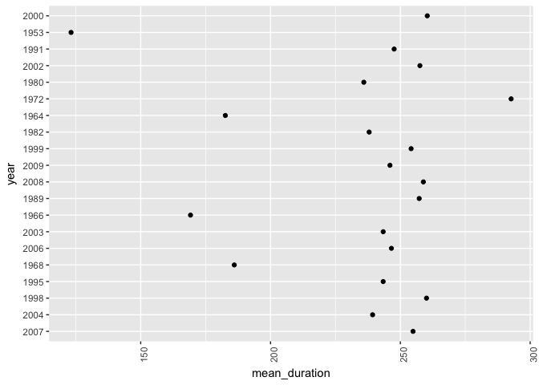
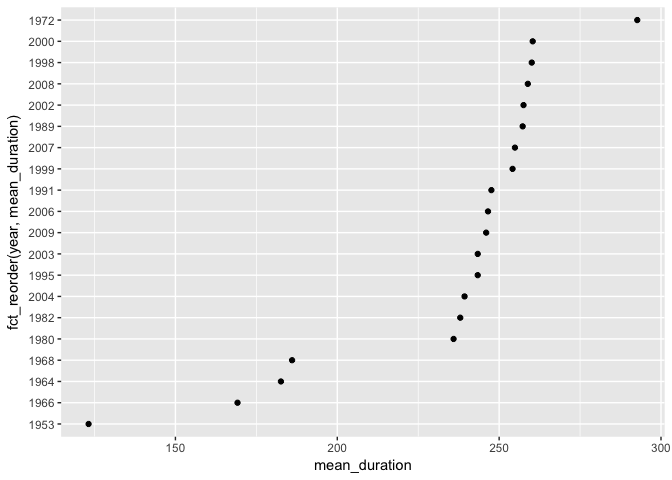
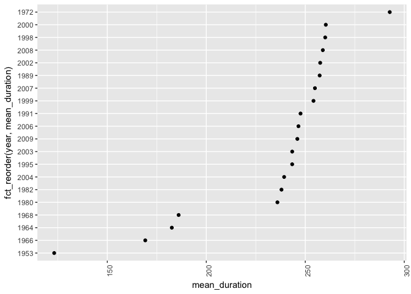

Factor and Figure management
================
Santiago David
2017-10-20

#### Load data and packages

``` r
suppressPackageStartupMessages(library(tidyverse))
suppressPackageStartupMessages(library(singer))
suppressPackageStartupMessages(library(forcats))
data("singer_locations")
```

Factor management
=================

### Singer version

#### **Objective 1 Factorise**:

Transform some of the variable in the singer\_locations dataframe into factors: pay attention at what levels you introduce and their order. Try and consider the difference between the base R as.factor and the forcats-provided functions

**Process**: We can start checking at the type of variables in `singer_locations`, and confirm that they are not `factors`

``` r
glimpse(singer_locations)
```

    ## Observations: 10,100
    ## Variables: 14
    ## $ track_id           <chr> "TRWICRA128F42368DB", "TRXJANY128F42246FC",...
    ## $ title              <chr> "The Conversation (Cd)", "Lonely Island", "...
    ## $ song_id            <chr> "SOSURTI12A81C22FB8", "SODESQP12A6D4F98EF",...
    ## $ release            <chr> "Even If It Kills Me", "The Duke Of Earl", ...
    ## $ artist_id          <chr> "ARACDPV1187FB58DF4", "ARYBUAO1187FB3F4EB",...
    ## $ artist_name        <chr> "Motion City Soundtrack", "Gene Chandler", ...
    ## $ year               <int> 2007, 2004, 1998, 1995, 1968, 2006, 2003, 2...
    ## $ duration           <dbl> 170.4485, 106.5530, 527.5947, 695.1179, 237...
    ## $ artist_hotttnesss  <dbl> 0.6410183, 0.3937627, 0.4306226, 0.3622792,...
    ## $ artist_familiarity <dbl> 0.8230522, 0.5700167, 0.5039940, 0.4773099,...
    ## $ latitude           <dbl> NA, 41.88415, 40.71455, NA, 42.33168, 40.99...
    ## $ longitude          <dbl> NA, -87.63241, -74.00712, NA, -83.04792, -7...
    ## $ name               <chr> NA, "Gene Chandler", "Paul Horn", NA, "Doro...
    ## $ city               <chr> NA, "Chicago, IL", "New York, NY", NA, "Det...

Now, I will save the database in a different object and will mutate `artist_name`, `year`, and `city` from character/integer to factor, but keeping the same variable names...

We can do this using Base R function `as.factor`.

``` r
singer_fact <- singer_locations %>% 
  mutate(artist_name = as.factor(artist_name),
         year = as.factor(year),
         city = as.factor(city))
glimpse(singer_fact) # to confirm they are factors now
```

    ## Observations: 10,100
    ## Variables: 14
    ## $ track_id           <chr> "TRWICRA128F42368DB", "TRXJANY128F42246FC",...
    ## $ title              <chr> "The Conversation (Cd)", "Lonely Island", "...
    ## $ song_id            <chr> "SOSURTI12A81C22FB8", "SODESQP12A6D4F98EF",...
    ## $ release            <chr> "Even If It Kills Me", "The Duke Of Earl", ...
    ## $ artist_id          <chr> "ARACDPV1187FB58DF4", "ARYBUAO1187FB3F4EB",...
    ## $ artist_name        <fctr> Motion City Soundtrack, Gene Chandler, Pau...
    ## $ year               <fctr> 2007, 2004, 1998, 1995, 1968, 2006, 2003, ...
    ## $ duration           <dbl> 170.4485, 106.5530, 527.5947, 695.1179, 237...
    ## $ artist_hotttnesss  <dbl> 0.6410183, 0.3937627, 0.4306226, 0.3622792,...
    ## $ artist_familiarity <dbl> 0.8230522, 0.5700167, 0.5039940, 0.4773099,...
    ## $ latitude           <dbl> NA, 41.88415, 40.71455, NA, 42.33168, 40.99...
    ## $ longitude          <dbl> NA, -87.63241, -74.00712, NA, -83.04792, -7...
    ## $ name               <chr> NA, "Gene Chandler", "Paul Horn", NA, "Doro...
    ## $ city               <fctr> NA, Chicago, IL, New York, NY, NA, Detroit...

Or we can also use `as_factor` from the package [forcats](https://www.rdocumentation.org/packages/forcats/versions/0.2.0).

    singer_forcats <- singer_locations %>% 
      mutate(artist_name = as_factor(artist_name),
            year = as_factor(year), 
            city = as_factor(city))   #gives error

However, there are two problems here, the first one is that `year` is an integer in the original database and can't be converted to factor using `as_factor`, and also `city` have NA's, which is giving an error. The solution I considered was to convert year from integer to character first, and then to factor using `as_factor`. Also, we have to specify an entry value for the missing information in city (we explored this in class)...

``` r
singer_forcats <- singer_locations %>% 
  mutate(artist_name = as_factor(artist_name),
        year = as.character(year),
        year = as_factor(year), 
        city = ifelse(is.na(city), "missing", city),
        city = as_factor(city))

glimpse(singer_forcats)
```

    ## Observations: 10,100
    ## Variables: 14
    ## $ track_id           <chr> "TRWICRA128F42368DB", "TRXJANY128F42246FC",...
    ## $ title              <chr> "The Conversation (Cd)", "Lonely Island", "...
    ## $ song_id            <chr> "SOSURTI12A81C22FB8", "SODESQP12A6D4F98EF",...
    ## $ release            <chr> "Even If It Kills Me", "The Duke Of Earl", ...
    ## $ artist_id          <chr> "ARACDPV1187FB58DF4", "ARYBUAO1187FB3F4EB",...
    ## $ artist_name        <fctr> Motion City Soundtrack, Gene Chandler, Pau...
    ## $ year               <fctr> 2007, 2004, 1998, 1995, 1968, 2006, 2003, ...
    ## $ duration           <dbl> 170.4485, 106.5530, 527.5947, 695.1179, 237...
    ## $ artist_hotttnesss  <dbl> 0.6410183, 0.3937627, 0.4306226, 0.3622792,...
    ## $ artist_familiarity <dbl> 0.8230522, 0.5700167, 0.5039940, 0.4773099,...
    ## $ latitude           <dbl> NA, 41.88415, 40.71455, NA, 42.33168, 40.99...
    ## $ longitude          <dbl> NA, -87.63241, -74.00712, NA, -83.04792, -7...
    ## $ name               <chr> NA, "Gene Chandler", "Paul Horn", NA, "Doro...
    ## $ city               <fctr> missing, Chicago, IL, New York, NY, missin...

Now, we can see that all three variables are of the type factor, we can also see the difference in the variable `city` between the two methods, since we assigned a new level called "missing" for the NA's, the second example now includes 1317 levels instead of 1316 for the same variable.

``` r
nlevels(singer_fact$city)
```

    ## [1] 1316

``` r
nlevels(singer_forcats$city)
```

    ## [1] 1317

#### **Objective 2 Drop 0**:

Filter the singer\_locations data to remove observations associated with the uncorrectly inputed year 0. Additionally, remove unused factor levels. Provide concrete information on the data before and after removing these rows and levels; address the number of rows and the levels of the affected factor.

**Process**: We can take advantage of our new database "singer\_forcats" with `year` as a factor to try this part. First how many observations were coded as 0, and how many levels do we have in that factor.

``` r
singer_forcats %>% 
  count(year == 0)
```

    ## # A tibble: 2 x 2
    ##   `year == 0`     n
    ##         <lgl> <int>
    ## 1       FALSE 10000
    ## 2        TRUE   100

``` r
nlevels(singer_forcats$year)
```

    ## [1] 70

We have 100 entries equal to 0 and 10000 for other years plus 70 levels in `year`, so now, I will filter the data for non-zero observations in `year` and save that as a new database. We can inspect the number of observations and levels on this new database:

``` r
singer_dropzero <- singer_forcats %>% 
  filter(year != "0")

singer_dropzero %>% 
  count(year != 0)
```

    ## # A tibble: 1 x 2
    ##   `year != 0`     n
    ##         <lgl> <int>
    ## 1        TRUE 10000

``` r
nlevels(singer_dropzero$year)
```

    ## [1] 70

Now, we effectively kept the 10000 observations, but we still have 70 levels!, we need to drop that unused `0` year and other unused levels associated with those observations in `artist_name` and `city`. For this reason it is better to use `droplevels()` from base R.

``` r
singer_drop_levels <- singer_dropzero %>% 
  droplevels()
```

To understand the effect of removing `year = 0` and `droplevels()`. We can compare the structure of both databases.

``` r
# before 
str(singer_forcats) 
```

    ## Classes 'tbl_df', 'tbl' and 'data.frame':    10100 obs. of  14 variables:
    ##  $ track_id          : chr  "TRWICRA128F42368DB" "TRXJANY128F42246FC" "TRIKPCA128F424A553" "TRYEATD128F92F87C9" ...
    ##  $ title             : chr  "The Conversation (Cd)" "Lonely Island" "Here's That Rainy Day" "Rego Park Blues" ...
    ##  $ song_id           : chr  "SOSURTI12A81C22FB8" "SODESQP12A6D4F98EF" "SOQUYQD12A8C131619" "SOEZGRC12AB017F1AC" ...
    ##  $ release           : chr  "Even If It Kills Me" "The Duke Of Earl" "Imprompture" "Still River" ...
    ##  $ artist_id         : chr  "ARACDPV1187FB58DF4" "ARYBUAO1187FB3F4EB" "AR4111G1187B9B58AB" "ARQDZP31187B98D623" ...
    ##  $ artist_name       : Factor w/ 7498 levels "Motion City Soundtrack",..: 1 2 3 4 5 6 7 8 9 10 ...
    ##  $ year              : Factor w/ 70 levels "2007","2004",..: 1 2 3 4 5 6 7 1 8 6 ...
    ##  $ duration          : num  170 107 528 695 237 ...
    ##  $ artist_hotttnesss : num  0.641 0.394 0.431 0.362 0.411 ...
    ##  $ artist_familiarity: num  0.823 0.57 0.504 0.477 0.53 ...
    ##  $ latitude          : num  NA 41.9 40.7 NA 42.3 ...
    ##  $ longitude         : num  NA -87.6 -74 NA -83 ...
    ##  $ name              : chr  NA "Gene Chandler" "Paul Horn" NA ...
    ##  $ city              : Factor w/ 1317 levels "missing","Chicago, IL",..: 1 2 3 1 4 5 1 1 1 1 ...

``` r
# after
str(singer_drop_levels) 
```

    ## Classes 'tbl_df', 'tbl' and 'data.frame':    10000 obs. of  14 variables:
    ##  $ track_id          : chr  "TRWICRA128F42368DB" "TRXJANY128F42246FC" "TRIKPCA128F424A553" "TRYEATD128F92F87C9" ...
    ##  $ title             : chr  "The Conversation (Cd)" "Lonely Island" "Here's That Rainy Day" "Rego Park Blues" ...
    ##  $ song_id           : chr  "SOSURTI12A81C22FB8" "SODESQP12A6D4F98EF" "SOQUYQD12A8C131619" "SOEZGRC12AB017F1AC" ...
    ##  $ release           : chr  "Even If It Kills Me" "The Duke Of Earl" "Imprompture" "Still River" ...
    ##  $ artist_id         : chr  "ARACDPV1187FB58DF4" "ARYBUAO1187FB3F4EB" "AR4111G1187B9B58AB" "ARQDZP31187B98D623" ...
    ##  $ artist_name       : Factor w/ 7408 levels "Motion City Soundtrack",..: 1 2 3 4 5 6 7 8 9 10 ...
    ##  $ year              : Factor w/ 69 levels "2007","2004",..: 1 2 3 4 5 6 7 1 8 6 ...
    ##  $ duration          : num  170 107 528 695 237 ...
    ##  $ artist_hotttnesss : num  0.641 0.394 0.431 0.362 0.411 ...
    ##  $ artist_familiarity: num  0.823 0.57 0.504 0.477 0.53 ...
    ##  $ latitude          : num  NA 41.9 40.7 NA 42.3 ...
    ##  $ longitude         : num  NA -87.6 -74 NA -83 ...
    ##  $ name              : chr  NA "Gene Chandler" "Paul Horn" NA ...
    ##  $ city              : Factor w/ 1309 levels "missing","Chicago, IL",..: 1 2 3 1 4 5 1 1 1 1 ...

**observations**: We can see now that there are 100 observations less after removing `year = 0`, but also that the number of levels changed from 7498 to 7408 for `artist_name`, from 70 to 69 for `year` and from 1317 to 1309 for `city` after dropping unused levels.

#### **Objective 3 Reorder the levels of year, artist\_name or title**:

Use the forcats package to change the order of the factor levels, based on a principled summary of one of the quantitative variables. Consider experimenting with a summary statistic beyond the most basic choice of the median.

**Process**: Since I have been working with `year` and `artist_name` but not `title`. I will only work with the first two in this section. I have the vague impression that songs were longer between 50's-80's than they are in recent years 90's-00's. So, I will focus in the variable `duration` and specifically in the `mean` duration for all songs per year and `max` duration for each artist.

``` r
fct_reorder(singer_drop_levels$year,
            singer_drop_levels$duration, fun = mean, .desc = TRUE) %>% 
  levels() %>% 
  head(10)
```

    ##  [1] "1972" "1973" "1976" "1970" "1979" "2001" "1984" "1985" "2000" "1998"

**observation**: I was wrong!, apparently songs were the longest in the 70's, but then also in 2001, 2000 relatively to other years.

We can also explore, which are the artists with the longest songs on average.

``` r
fct_reorder(singer_drop_levels$artist_name,
            singer_drop_levels$duration, fun = max, .desc = TRUE) %>% 
  levels() %>% 
  head(10)
```

    ##  [1] "Emerson_ Lake & Palmer" "Lard"                  
    ##  [3] "Tiny Vipers"            "Takagi Masakatsu"      
    ##  [5] "Archie Shepp"           "Home Grown"            
    ##  [7] "Pygmy Lush"             "Bill Laswell"          
    ##  [9] "Henry Rollins"          "Deep Purple"

**Observations**: Don't know most of these artists, but they have at least one super long song

#### **Extra Objectives (Common part)**:

-   Explore the effects of arrange(). Does merely arranging the data have any effect on, say, a figure?
-   Explore the effects of reordering a factor and factor reordering coupled with arrange(). Especially, what effect does this have on a figure?

**Process**: We can use the previous examples. First for average song `duration` and `year`. We start by creating a subset of this data. Only for 20 years, so that we can easily see the effect in figures...

``` r
singer_subset <- singer_drop_levels %>% 
  group_by(year) %>% 
  summarise(mean_duration = mean(duration)) %>% 
  head(20)
```

We can use `arrange()` on the factor `year` and check if there is any effect in the plot.

``` r
arrange(singer_subset, mean_duration) %>% 
  ggplot(aes(mean_duration, year)) +
  geom_point() +
  theme(axis.text.x = element_text(angle = 90, hjust = 1))
```



**Observations**: In the previous plot we can see that although we used `arrange()` to sort `mean_duration` by year in descending order, R still keeps the arbitrary order of levels, so that the trend is not really evident.

Now we can try reordering the factor with `fct_reorder` and do the same plot.

``` r
ggplot(singer_subset, (aes(x = mean_duration, y = fct_reorder(year, mean_duration)))) +
  geom_point() +
  theme(axis.text.x = element_text(angle = 90, hjust = 1))
```



**Observations**: Now, in this plot we can clearly see which years have on average a long song duration, and which ones a shorter one, since they are reorder based on the quantitative variable. Note: I didn't put that much effort in graphs customization, since that's not the objective here...

Also, If we use `arrange()` and `fct_reorder`, we have the same effect than just using `fct_reorder`

``` r
arrange(singer_subset, mean_duration) %>% 
ggplot(aes(x = mean_duration, y = fct_reorder(year, mean_duration))) +
  geom_point() +
  theme(axis.text.x = element_text(angle = 90, hjust = 1))
```



File I/O
========

**Objective**:

-   Experiment with one or more of `write_csv()/read_csv()`, `saveRDS()/readRDS()`
-   Create something new, probably by filtering or grouped-summarization of Singer or Gapminder
-   Fiddle with factor levels, and Explore whether this survives the round trip of writing to file then reading back in.

**Process**: I start by creating a new summary from `singer` to write in and out in this part of the homework. I don't remember what `artist_hotttnesss` mean, but I guess it is some sort of popularity measurement, so let's try to get then mean `artist_hotttnesss` across years for each artist. I will use `singer_forcats`, since I already coded artist\_name and year as factors in that database.

``` r
artist_hotness <- singer_forcats %>% 
  group_by(artist_name) %>% 
  summarise(mean_hotness = mean(artist_hotttnesss))
str(artist_hotness)
```

    ## Classes 'tbl_df', 'tbl' and 'data.frame':    7498 obs. of  2 variables:
    ##  $ artist_name : Factor w/ 7498 levels "Motion City Soundtrack",..: 1 2 3 4 5 6 7 8 9 10 ...
    ##  $ mean_hotness: num  0.641 0.394 0.431 0.362 0.411 ...

``` r
head(artist_hotness)
```

    ## # A tibble: 6 x 2
    ##                      artist_name mean_hotness
    ##                           <fctr>        <dbl>
    ## 1         Motion City Soundtrack    0.6410183
    ## 2                  Gene Chandler    0.3937627
    ## 3                      Paul Horn    0.4306226
    ## 4 Ronnie Earl & the Broadcasters    0.3622792
    ## 5                  Dorothy Ashby    0.4107520
    ## 6                    Barleyjuice    0.3762635

I will use `write_csv` and `read_csv` to get this subset of data in and out of r...

``` r
write_csv(artist_hotness, "artist_hotness.csv")

# now read them back
artist_hotness <- read_csv("artist_hotness.csv") %>% 
  mutate(artist_name = as_factor(artist_name)) # creating factor
```

    ## Parsed with column specification:
    ## cols(
    ##   artist_name = col_character(),
    ##   mean_hotness = col_double()
    ## )

``` r
glimpse(artist_hotness)
```

    ## Observations: 7,498
    ## Variables: 2
    ## $ artist_name  <fctr> Motion City Soundtrack, Gene Chandler, Paul Horn...
    ## $ mean_hotness <dbl> 0.6410183, 0.3937627, 0.4306226, 0.3622792, 0.410...

The file was indeed exported and imported without major issues. However, `artist_name` was imported as a character variable instead of a factor... Let's mutate that again, and check the order of levels in this file

``` r
head(levels(artist_hotness$artist_name))
```

    ## [1] "Motion City Soundtrack"         "Gene Chandler"                 
    ## [3] "Paul Horn"                      "Ronnie Earl & the Broadcasters"
    ## [5] "Dorothy Ashby"                  "Barleyjuice"

This order doesn't seem to follow any particular rule, it is just the first artist names entered in the original database. I will reorder the `artist_name` factor levels according to mean hotness in decreasing order.

``` r
artist_hotness <- artist_hotness %>% 
  mutate(artist_name = fct_reorder(artist_name, mean_hotness, .desc = TRUE))
head(levels(artist_hotness$artist_name))
```

    ## [1] "Daft Punk"       "Black Eyed Peas" "Coldplay"        "Rihanna"        
    ## [5] "Rihanna / Slash" "T.I."

Alrigth, so now we know that Daft Punk, Black Eyes Peas, and Coldplay, are the artists with the highest mean hotness index, and also our levels are organized that way... I will export this again using `write_csv` and `saveRDS()` and read them back...

``` r
write_csv(artist_hotness, "artist_hotness.csv")
saveRDS(artist_hotness, "artist_hotness.rds")

# Now read them back
artist_via_csv <- read_csv("artist_hotness.csv") %>% 
  mutate(artist_name = as_factor(artist_name)) # with factor
```

    ## Parsed with column specification:
    ## cols(
    ##   artist_name = col_character(),
    ##   mean_hotness = col_double()
    ## )

``` r
artist_via_rds <- readRDS("artist_hotness.rds")
```

Lets take a look again at the order of levels for these two files

``` r
head(levels(artist_via_csv$artist_name))
```

    ## [1] "Motion City Soundtrack"         "Gene Chandler"                 
    ## [3] "Paul Horn"                      "Ronnie Earl & the Broadcasters"
    ## [5] "Dorothy Ashby"                  "Barleyjuice"

``` r
head(levels(artist_via_rds$artist_name))
```

    ## [1] "Daft Punk"       "Black Eyed Peas" "Coldplay"        "Rihanna"        
    ## [5] "Rihanna / Slash" "T.I."

**Observations**: The first route, using `write_csv` and `read_csv` didn't conserve the reorder we computed based on mean hotness, but the second option using `saveRDS()` and `readRDS()` did it. I had to read and google what the .rds file was, since I have never use it. I also got a lot of help from the materials of this class for last year.

Visualization design
====================

**Objective**: Remake at least one figure or create a new one, in light of something you learned in the recent class meetings about visualization design and color. Maybe juxtapose your first attempt and what you obtained after some time spent working on it. Reflect on the differences.

\*Process\*\*: working...

``` r
singer_forcats %>% 
  group_by(year) %>% 
  summarise(mean_duration = mean(duration),
            mean_hotness = mean(artist_hotttnesss))
```

    ## # A tibble: 70 x 3
    ##      year mean_duration mean_hotness
    ##    <fctr>         <dbl>        <dbl>
    ##  1   2007      254.8794    0.4177400
    ##  2   2004      239.3157    0.4171090
    ##  3   1998      260.0710    0.4095104
    ##  4   1995      243.3836    0.4068184
    ##  5   1968      186.0353    0.4303272
    ##  6   2006      246.5558    0.4083919
    ##  7   2003      243.3904    0.4201097
    ##  8   1966      169.1816    0.4237375
    ##  9   1989      257.2638    0.4119238
    ## 10   2008      258.8586    0.4253368
    ## # ... with 60 more rows

Writing figures to file
=======================

Clean up your repo!
===================
