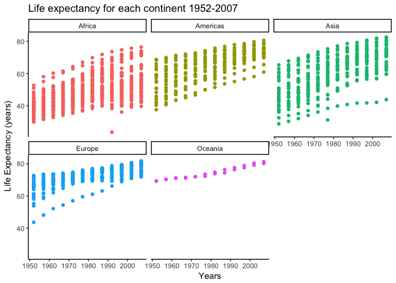
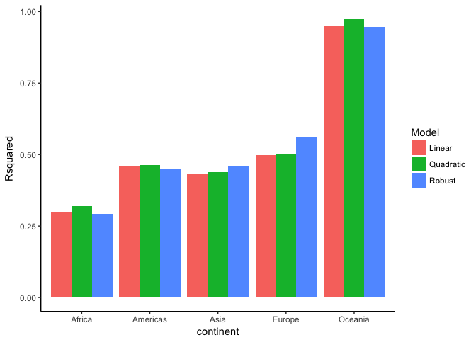

Data Wrangling wrap up
================
Santiago David
2017-11-07

-   [Writing functions](#Writing-functions)

#### Load data and packages

``` r
suppressPackageStartupMessages(library(tidyverse))
suppressPackageStartupMessages(library(gapminder))
suppressPackageStartupMessages(library(purrr))
suppressPackageStartupMessages(library(stringr))
suppressPackageStartupMessages(library(broom))
data("gapminder")
```

Writing functions
=================

**Objective**: Write one (or more) functions that do something useful to pieces of the Gapminder or Singer data. Make it something that’s not trivial to do with the simple dplyr verbs.

**Process**: The homework provide a good starting point with the gapminder data following Jenny's [tutorial](http://stat545.com/block012_function-regress-lifeexp-on-year.html) to create a linear regression of life expectancy on year. However, First things first, let's plot the data!

``` r
ggplot(gapminder, aes(year, lifeExp, colour = continent)) +
  geom_point() +
  facet_wrap(~ continent) +
  labs(title = "Life expectancy for each continent 1952-2007", x = "Years", y = "Life Expectancy (years)") +
  guides(colour = FALSE) +
  theme_classic() 
```



From these graphs, we can see that there is an increasing trend of life expectancy over years, However, a priori, we dont really know if the relationship is different for each country/continent, if the relationship between Life expectancy and year is linear, cuadratic, or whether a robust regression is more apropiate given the possibility that some values are outliers or influential observations. For example, what about that steep line of points in Europe?, or that odd red dot in Africa in the 90's?. For this reason, it is worth to create functions for different models that we can fit either to each continent, or country (or other similar data).

The ideal function, will be one that takes a variable `life expectancty` and `year` as input, fit a model, and return the coefficients `intercept`, and `slope` and potentially the `R-squared` as a way to understand how well the model fit the data...

#### **Create some code**

We should start by fitting the models, and check how they behave by extracting the coefficients:

``` r
# three models
linear1 <- lm(lifeExp ~ I(year - 1952), gapminder)
quadra1 <- lm(lifeExp ~ I(year - 1952) + I((year - 1952)^2), gapminder)
robust1 <- robustbase::lmrob(lifeExp ~ I(year - 1952), gapminder)
```

We have to use `I(year - 1952)` instead of just `year` to fix the intercept to life expectancy on year 1952 (following Jenny Bryan's [post](http://stat545.com/block012_function-regress-lifeexp-on-year.html))

Now, let's see the parameters

``` r
#coefficients
coef(linear1)
```

    ##    (Intercept) I(year - 1952) 
    ##     50.5120841      0.3259038

``` r
coef(quadra1)
```

    ##        (Intercept)     I(year - 1952) I((year - 1952)^2) 
    ##       48.916137600        0.517417408       -0.003482065

``` r
coef(robust1)
```

    ##    (Intercept) I(year - 1952) 
    ##     50.1219139      0.3500189

And the adjusted R-squared to get a sense of how close the data are to the fitted regression line

``` r
#adjusted r squared
summary(linear1)$adj.r.squared
```

    ## [1] 0.1892811

``` r
summary(quadra1)$adj.r.squared
```

    ## [1] 0.1938648

``` r
summary(robust1)$adj.r.squared
```

    ## [1] 0.1946681

Now, we see that the robust and quadratic models perform a bit better than the simple linear model. But remember this is for the `whole` data. Now, we want to create a function with that code that we can apply to subsets of the data.

#### **Turn code into a function**

I can fit a function for each model separately... starting with the simple linear regression

``` r
linear_mod <- function(dat, offset = 1952) {
  model <- lm(lifeExp ~ I(year - offset), dat)
  intercept <- coef(model)[1]
  slope <- coef(model)[2]
  adjusted_Rsquared <- summary(model)$adj.r.squared
  data.frame(intercept, slope, adjusted_Rsquared) %>% 
  setNames(c("Intercept", "Slope", "R-squared"))
}
```

Note, that here, we created an `offset` to specify an argument in the function, and defined specific objects for each parameter we are interested in, by extracting the first `[1]` and second `[2]` elements of the `coef` object and the `adj.r.squared` element of the summary object. We then create a data.frame with those value...

Lets apply this function to the whole gapminder dataset.

``` r
linear_mod(gapminder)
```

    ##             Intercept     Slope R-squared
    ## (Intercept)  50.51208 0.3259038 0.1892811

We can see that these values correspond to the values above (model = linear1), obtained by fitting a simple regression to Life expectancy and year to gapminder. So that's good, the function is doing what we think it is doing...

**Now** We can fix a separate function for the quadractic and robust regression models, or **even better**... Try to create a function that fit all three models at once, extract the three parameters of interest `intercept`, `slope`, and `R-squared` from each model and output a single table with those values...

``` r
fit_all_models <- function(dat, offset = 1952) {
  # three models
  linear <- lm(lifeExp ~ I(year - offset), dat)
  quadra <- lm(lifeExp ~ I(year - offset) + I((year - offset)^2), dat)
  robust <- robustbase::lmrob(lifeExp ~ I(year - offset), dat)
  # parameters
  model <- c("Linear", "Quadratic", "Robust")
  intercept <- c(coef(linear)[1], coef(quadra)[1], coef(robust)[1])
  slope <- c(coef(linear)[2], coef(quadra)[2], coef(robust)[2])
  Adjusted_Rsquared <- c(summary(linear)$adj.r.squared, summary(quadra)$adj.r.squared, 
                         summary(robust)$adj.r.squared)
  # what we want for the output
  tibble(model, intercept, slope, Adjusted_Rsquared) %>% 
  setNames(c("Model", "Intercept", "Slope", "Rsquared"))
}
```

Okay, let's see if it works for the whole gapminder... we should obtain exactly the same values we obtained in the first place, by fitting the three models to gapminder and extracting the values independently.

``` r
fit_all_models(gapminder)
```

    ## # A tibble: 3 x 4
    ##       Model Intercept     Slope  Rsquared
    ##       <chr>     <dbl>     <dbl>     <dbl>
    ## 1    Linear  50.51208 0.3259038 0.1892811
    ## 2 Quadratic  48.91614 0.5174174 0.1938648
    ## 3    Robust  50.12191 0.3500189 0.1946681

**Observations**: This function allows us to test three models at once to a set of data with a `Life expectancy` and `year` variables, extract the parameters of interest from each model and compared them easily in a single output table; So, now we can use this function to fit the models for each continent (or country)...

Let's try it for each continent, using the function `do`. We can check the output in a table

``` r
gapminder %>% 
  group_by(continent) %>% 
  do(fit_all_models(.)) %>% 
  knitr::kable(format = "markdown")
```

| continent | Model     |  Intercept|      Slope|   Rsquared|
|:----------|:----------|----------:|----------:|----------:|
| Africa    | Linear    |   40.90328|  0.2895293|  0.2976269|
| Africa    | Quadratic |   38.53130|  0.5741664|  0.3188398|
| Africa    | Robust    |   40.78514|  0.2806586|  0.2921317|
| Americas  | Linear    |   54.54834|  0.3676509|  0.4608435|
| Americas  | Quadratic |   53.41509|  0.5036401|  0.4639434|
| Americas  | Robust    |   55.07642|  0.3605386|  0.4476621|
| Asia      | Linear    |   47.60404|  0.4531224|  0.4342026|
| Asia      | Quadratic |   45.95293|  0.6512555|  0.4392204|
| Asia      | Robust    |   47.43609|  0.4704215|  0.4580228|
| Europe    | Linear    |   65.80055|  0.2219321|  0.4970649|
| Europe    | Quadratic |   65.05472|  0.3114316|  0.5019442|
| Europe    | Robust    |   67.07912|  0.1969165|  0.5597119|
| Oceania   | Linear    |   68.54372|  0.2102724|  0.9519800|
| Oceania   | Quadratic |   69.49916|  0.0956199|  0.9736564|
| Oceania   | Robust    |   68.58637|  0.2095208|  0.9473769|

Or visualize one parameter, such as the Adjusted R-squared per model for each continent in a graph...

``` r
gapminder %>% 
  group_by(continent) %>% 
  do(fit_all_models(.)) %>% 
  ggplot(aes(x=continent, y= Rsquared , fill = Model)) +
           geom_bar(position = "dodge", stat = "identity") +
           theme_classic()
```



Now we can compare the `Intercept`, `Slope` and `Adjusted R-squared` per model for each continent with a single function that can be modified easily, if we want to extract something else from these models. Of course for statistical purposes, it is necessary to explore other aspects of these models, such as the estimated coefficients, F-test, etc... and not just the Adjusted R-squared values...

Work with a nested data frame
=============================

**Objective**: Create a nested data frame and map a function over the list column holding the nested data. Try to extract parameters from the models and go back to a simple data frame with summarized results.

**Process**: First, I will "nest" the data in gapminder by continent and country, using `nest()`...

``` r
gap_nested <- gapminder %>% 
  group_by(continent, country) %>% 
  nest()
gap_nested
```

    ## # A tibble: 142 x 3
    ##    continent     country              data
    ##       <fctr>      <fctr>            <list>
    ##  1      Asia Afghanistan <tibble [12 x 4]>
    ##  2    Europe     Albania <tibble [12 x 4]>
    ##  3    Africa     Algeria <tibble [12 x 4]>
    ##  4    Africa      Angola <tibble [12 x 4]>
    ##  5  Americas   Argentina <tibble [12 x 4]>
    ##  6   Oceania   Australia <tibble [12 x 4]>
    ##  7    Europe     Austria <tibble [12 x 4]>
    ##  8      Asia     Bahrain <tibble [12 x 4]>
    ##  9      Asia  Bangladesh <tibble [12 x 4]>
    ## 10    Europe     Belgium <tibble [12 x 4]>
    ## # ... with 132 more rows

We can see that this "new" dataframe collapsed all information associated to each country in a new variable `data` of the type `list`. I don't really need to inspect this list, since we know what there is inside, but just to give an example to my future self, this is how I can access information for a specific element.

``` r
gap_nested[[1, "data"]]
```

    ## # A tibble: 12 x 4
    ##     year lifeExp      pop gdpPercap
    ##    <int>   <dbl>    <int>     <dbl>
    ##  1  1952  28.801  8425333  779.4453
    ##  2  1957  30.332  9240934  820.8530
    ##  3  1962  31.997 10267083  853.1007
    ##  4  1967  34.020 11537966  836.1971
    ##  5  1972  36.088 13079460  739.9811
    ##  6  1977  38.438 14880372  786.1134
    ##  7  1982  39.854 12881816  978.0114
    ##  8  1987  40.822 13867957  852.3959
    ##  9  1992  41.674 16317921  649.3414
    ## 10  1997  41.763 22227415  635.3414
    ## 11  2002  42.129 25268405  726.7341
    ## 12  2007  43.828 31889923  974.5803

Now, I can start applying **my** function `fit_all_models` over the nested dataframe. Let's do it for all countries applying `purrr:map()`. Following the recommendation in the [split-apply-combine](http://stat545.com/block024_group-nest-split-map.html) lesson, we can use mutate to create a new column in the same dataframe for the output of this function...

``` r
(gap_nested <- gap_nested %>% 
  mutate(model_fits = map(data, fit_all_models)))
```

    ## # A tibble: 142 x 4
    ##    continent     country              data       model_fits
    ##       <fctr>      <fctr>            <list>           <list>
    ##  1      Asia Afghanistan <tibble [12 x 4]> <tibble [3 x 4]>
    ##  2    Europe     Albania <tibble [12 x 4]> <tibble [3 x 4]>
    ##  3    Africa     Algeria <tibble [12 x 4]> <tibble [3 x 4]>
    ##  4    Africa      Angola <tibble [12 x 4]> <tibble [3 x 4]>
    ##  5  Americas   Argentina <tibble [12 x 4]> <tibble [3 x 4]>
    ##  6   Oceania   Australia <tibble [12 x 4]> <tibble [3 x 4]>
    ##  7    Europe     Austria <tibble [12 x 4]> <tibble [3 x 4]>
    ##  8      Asia     Bahrain <tibble [12 x 4]> <tibble [3 x 4]>
    ##  9      Asia  Bangladesh <tibble [12 x 4]> <tibble [3 x 4]>
    ## 10    Europe     Belgium <tibble [12 x 4]> <tibble [3 x 4]>
    ## # ... with 132 more rows

Now, we have a column with the output of the function `fit_all_models` called `model_fits`, which happens to be another tibble... Again, we can inspect the info in that element for the first country in the database...

``` r
gap_nested[[1, "model_fits"]]
```

    ## # A tibble: 3 x 4
    ##       Model Intercept     Slope  Rsquared
    ##       <chr>     <dbl>     <dbl>     <dbl>
    ## 1    Linear  29.90729 0.2753287 0.9424835
    ## 2 Quadratic  28.17869 0.4827616 0.9868071
    ## 3    Robust  29.83807 0.2767131 0.9364287

Finally, we can extract the information in this column for all countries by `unnesting` the dataframe to a normal tibble...

``` r
(gap_nested %>% 
   select(continent, country, model_fits) %>% 
   unnest(model_fits) %>% 
   head())
```

    ## # A tibble: 6 x 6
    ##   continent     country     Model Intercept     Slope  Rsquared
    ##      <fctr>      <fctr>     <chr>     <dbl>     <dbl>     <dbl>
    ## 1      Asia Afghanistan    Linear  29.90729 0.2753287 0.9424835
    ## 2      Asia Afghanistan Quadratic  28.17869 0.4827616 0.9868071
    ## 3      Asia Afghanistan    Robust  29.83807 0.2767131 0.9364287
    ## 4    Europe     Albania    Linear  59.22913 0.3346832 0.9016355
    ## 5    Europe     Albania Quadratic  56.85313 0.6198024 0.9530084
    ## 6    Europe     Albania    Robust  62.52934 0.2510398 0.9751008

**Okay**, so far so good... I practice applying a function that I created over elements of a nested dataframe. However, for this specific example, you might notice that this long process was unnecessary, given that in my original function, I already specified the elements I wanted from the models, so, just by simply applying the function over the database, grouped by continent and country, I will obtain exactly the same dataframe as above...

``` r
(gapminder %>% 
  group_by(country, continent) %>% 
  do(fit_all_models(.))) %>% 
  head() %>% 
  knitr::kable(format = "markdown")
```

| country     | continent | Model     |  Intercept|      Slope|   Rsquared|
|:------------|:----------|:----------|----------:|----------:|----------:|
| Afghanistan | Asia      | Linear    |   29.90729|  0.2753287|  0.9424835|
| Afghanistan | Asia      | Quadratic |   28.17869|  0.4827616|  0.9868071|
| Afghanistan | Asia      | Robust    |   29.83807|  0.2767131|  0.9364287|
| Albania     | Europe    | Linear    |   59.22913|  0.3346832|  0.9016355|
| Albania     | Europe    | Quadratic |   56.85313|  0.6198024|  0.9530084|
| Albania     | Europe    | Robust    |   62.52934|  0.2510398|  0.9751008|

Another option using Broom... Explore later

{r} tidy(linear\_mod) tidy(quadra\_mod) glance(quadra\_mod) tidy(robust\_mod)

Another option for robust regression {r} library(robust) robust &lt;- robust::lmRob(lifeExp ~ I(year - 1952), gapminder)
