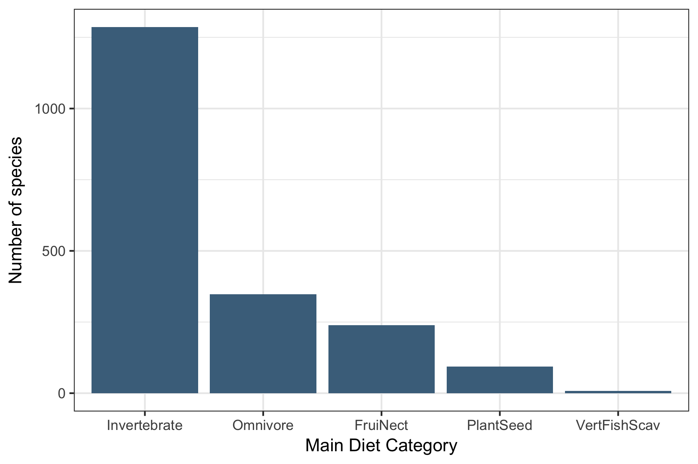
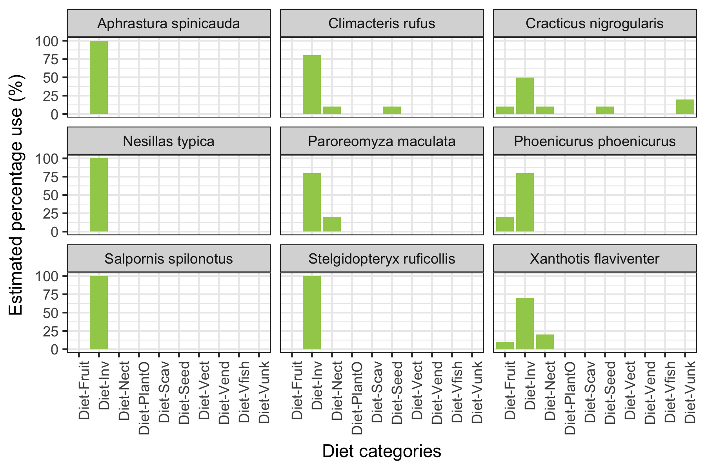
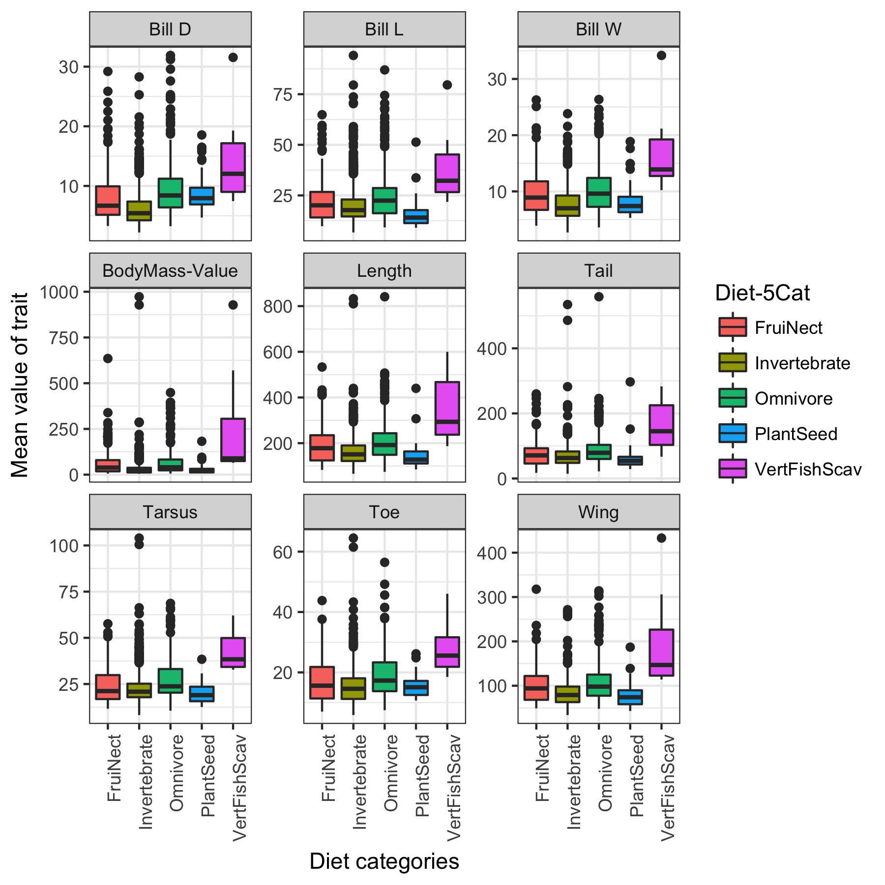

# Automating Data-analysis Pipelines
Santiago David  
2017-11-14  

For this homework I decided to play my own adventure (I'm also a bit sick of using gapminder...), So, I will use two recently published databases for bird species. One is for morphological traits for one quarter of the birds of the world (~2500), the other one is about functional traits such as diet, foraging strata for all bird species in the world (~10000).

The original publications that provided these **awesome** databases are:
- Wilman etal. 2014 Elton Traits 1.0: Species-level foraging attributes of the world's birds and mammals. Ecology 95:2027 [link](http://onlinelibrary.wiley.com/doi/10.1890/13-1917.1/abstract)
- Ricklefs 2017 Passerine morphology: external measurements of approximately one-quarter of passerines bird species. Ecology 98(5): 1472 [link](http://onlinelibrary.wiley.com/doi/10.1002/ecy.1783/suppinfo) 

These two databases provide a unique oportunity to explore the relationship between morphology and ecological function for hundreds of species of birds, but to do that we have to download the data, join, clean, tidy and analyze them...

### **Main objectives**: 
The general objective is to build an analytical pipeline using `Make` that can run different Rscripts to 
1 - Download data from the internet from two sources
2 - Read, Join, Filter and Clean the data for Analysis and Graphics
3 - Analyze the combined dataset in different ways to produce some summary graphs
4 - Render this R Markdown document without using RStudio's buttons.

### **Secondary objectives**
The authors of these two papers did a really good job in "Tidying" the data, so that the published databases are more or less clean... However, I still had to practice a lot of the tools we learn in STAT545 such as `joins`, `dplyr`, `write data in and out`, lots of `ggplot`, and some new things such as extracting data from a `.zip` file (Yes! we can do that...)

### Files in this folder

I'm not going to repeat the codes I used in each single file, because the idea in this assignment is to focus in the pipeline. So, if you are curious about each step, please go to the files and inspect the code in the plain Rscripts... I tried to include comments before each chunk so that the purpose of the code is clear.

Now, lets jump to some summary figures! (the only purpose of this Rmd file)

### Figures

- How many species of birds belong to one of the five dominant diet categories PlantSeed,  FruiNect, Invertebrate, VertFishScav or Omnivore

- Diet in this database is also represented as the % use of different food sources per species, lets show this visaully for 9 species selected at random from the pool. Some of them might be 100% insectivorous or a mixed of 50-50% two types of diet

- Now, more complex graphs. Let's explore the distribution of different morphological traits per diet category. Can you spot some outliers in terms of their mass?, or the size of their bills?

-  Birds' bill morphology and mass might be related to their primary diet. Lets plot the relationship between Body mass and Bill length for 1975 species, but identifying each diet category

- And now, what about tarsus and mass?, are there differences in this relationship for each of the diet groups? Check at the difference in slopes for each diet group...

####**Observations**
The magic of this exercise, is that by combining two databases for morphological and functional tratis of about 2000 bird species, we can really explored a lot of potential patterns and predictions, both with analysis and graphs.  
This might serve as a tool for anyone interested in playing with this data, and to myself for some of my own research analysis in the future.

