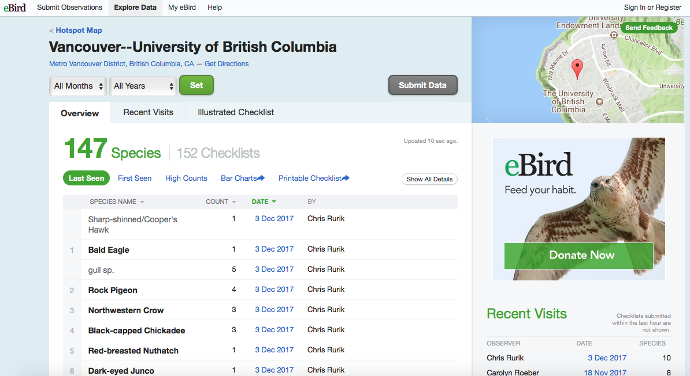

Since we already practiced with Web scraping and using API queries in class, I decided that for this homeworkd I will use an R package that wraps an API from the rOpenSci in order to get data from the web.

`reBird` is a package that interface with the [eBird](http://ebird.org/content/ebird/) website, which is a real-time, online bird checklist program that allows birders to record the birds they see, keep track of their lists and at the same time, contribute to science and conservation. Click [here](https://github.com/ropensci/rebird) for more info

`rplos` on the other side, is a package for accessing full text articles from the Public Library of Science journals using their API. Click [here](https://github.com/ropensci/rplos) for more info.

### **Main objectives**: 
The general objective is to combine information from these two rOpenSci packages to explore how many articles have been published on a bird species. I will do these for all the bird species recorded on eBird for the UBC campus.

Specifically, I did the following:
1 - Download data from the internet from two sources
2 - Read, Join, Filter and Clean the data for Analysis and Graphics
3 - Analyze the combined dataset in different ways to produce some summary graphs
4 - Render this R Markdown document without using RStudio's buttons.

### **Process**

**First**, we need to install and load both packages
```{r}
#install.packages("rebird")
#install.packages("rplos")
suppressPackageStartupMessages(library(tidyverse))
suppressPackageStartupMessages(library(knitr))
suppressPackageStartupMessages(library(rebird))
suppressPackageStartupMessages(library(rplos))
```

**`rebird` data**
There are several ways to extract information from **eBird** using `rebird`, for example, you can search bird species for a "region", using short codes that refers to political units, for example a country, lets explore the number of birds recorded for CANADA = CAN

```{r}
canadianbirds <- ebirdregion("CA")
canadianbirds %>% 
  head() %>% 
  knitr::kable()
```

We can see that `rebird` gives us a lot of information such as scientific name, common name, locality, coordinates... But, the amount of birds in Canada is probably too much for this exercise..., let's narrow it down to birds in UBC campus

For this, we can extract information for a particular geographic location by using `rebird` function `ebirdhotspot()`, which uses categories assigned in `ebird` for particular areas

If we search for birds in [UBC campus](http://ebird.org/ebird/hotspot/L344557) on the website, we will observe something like this:


But, we want to get that list on R..., so we can use the code for Vancouver-UBC which is "L344557". (Note: The maximum number of days back allowed to look for observations is 30)

```{r}
ubcbirds <- ebirdhotspot(locID = "L344557", back = 30) 

glimpse(ubcbirds)

ubcbirds %>%
  head() %>%
  kable()
```

Apparently, in the last month, there have been only 19 species of birds recorded at UBC campus (or at least 19 submitted to ebird), we know there are way more birds on campus, but it's okay... We can work with this list and explore how many articles have been published about these species of birds. 

But **before** moving to the second part, we should tidy this list first, right?, lets make sure scientific names are correct (i.e. binomial) and unique for each secies...

```{r}
ubcbirds$sciName 
```

There are two dubious names on this list (i.e. observer didn't know exactly which species it was), so let's get rid off them and select only variables of interest...

```{r}
ubcbirds2 <- ubcbirds %>% 
  filter(!(sciName == "Larinae sp." | sciName == "Accipiter striatus/cooperii")) %>% 
  select(sciName, howMany, comName, lat, lng)
```


**`rplos` data**
Now we can use `rplos` package to extract information of articles from the Public Library of Science journals using their API. The package offers a wide range of functions to access this information, such as:

- `searchplos()`, the basic function for searching plos
- `plosauthor()`, search on author name
- `plostitle()`, search the title
- `plosabstract()`, search the abstract
- `plossubject()`, search by subject
- `citations()`, search the PLOS Rich Citations
- `plos_fulltext()`, retrieve full text using a DOI
- `highplos()`, highlight search terms in the results.
- `highbrow()`, browse search terms in a browser with hyperlinks.

But, we only need the number of articles published for each bird species recorded in the UBC campus in the last month... So, we can use `searchplos()` with several arguments for the results

Let's do it for one species first...

```{r}
crowpapers <- searchplos(q = 'Corvus caurinus',
           fl = c("id", "publication_date", "title", "abstract"))
```

This simple code basically sends a request to the PLOS API to retrieve information about papers published for the "Northwestern Crow (Corvus caurinus)"... Let's inspect that object

```{r}
crowpapers
```

This object is basically a list with two elements `$meta` which stands for the number of records found and `$data` which contains the information we asked PLOS for... So, this is useful... We want this information for the 17 species in our list!

But, let's explore the number of papers published for this species, we can access that info by getting into the list elements

```{r}
crowpapers$meta$numFound
```

There were four papers retrieved!

Now, to get the data for the 17 species in our UBC-bird-list, I will define a function that run the query and retrieve the information for each species name... It will be good to include a `sleep time` parameter, because there is a maximum limit of 10 request per minute on the website.

```{r}
extract_papers <- function(sciName){
  searchplos(q = sciName, fl = c("id", "publication_date", "title", "abstract"), sleep = 10)
}
```

Now, we can `map` this function to the ubc bird list and save it on the dataframe, and because the result of the `searchplos()` function is a list, it means we will have a nested dataframe... Luckily we learned how to handle those...

```{r}
(ubcbirds2 <- ubcbirds2 %>% 
  mutate(info_papers = map(sciName, extract_papers)))
```

Pretty good ehh! Now, our original question is, **how many articles have been published on a bird species?** This information is contained in our list object `info_papers`, but let's make it more explicit by extracting the number of papers from the object, but also keeping all the information ("id", "publication_date", "title", "abstract") in another list in the dataframe...

```{r}
ubcbirds2 <- ubcbirds2 %>% 
  mutate(N_papers = ubcbirds2$info_papers %>%
                    map_int(~ .x[[1]][[1]][[1]]), # extract only number of papers
        info_papers = ubcbirds2$info_papers %>%
                      map(~ .x[[2]]))  # extract list of papers and override that column

head(ubcbirds2) 
```

Excellent!, Basically this is what I wanted a dataframe with the bird species recorded in eBird in the last month for the UBC campus, and a list of the papers published in PLOS for each of those species, I also extracted important info from those papers such as the "publication_date", "title", and "abstract"... 

Now, we can easily `unnest()` these papers list and export that info as a .csv file if we want to have a separate copy

```{r}
full_list <- ubcbirds2 %>% 
  unnest(info_papers)

head(full_list) #see head of full list

write_csv(full_list, "ubc_birds_papers_published.csv") #save file
```

The one last thing, I would like to do, is just visualize the number of papers published per species...

```{r}
ubcbirds2 %>% 
  ggplot()
```


